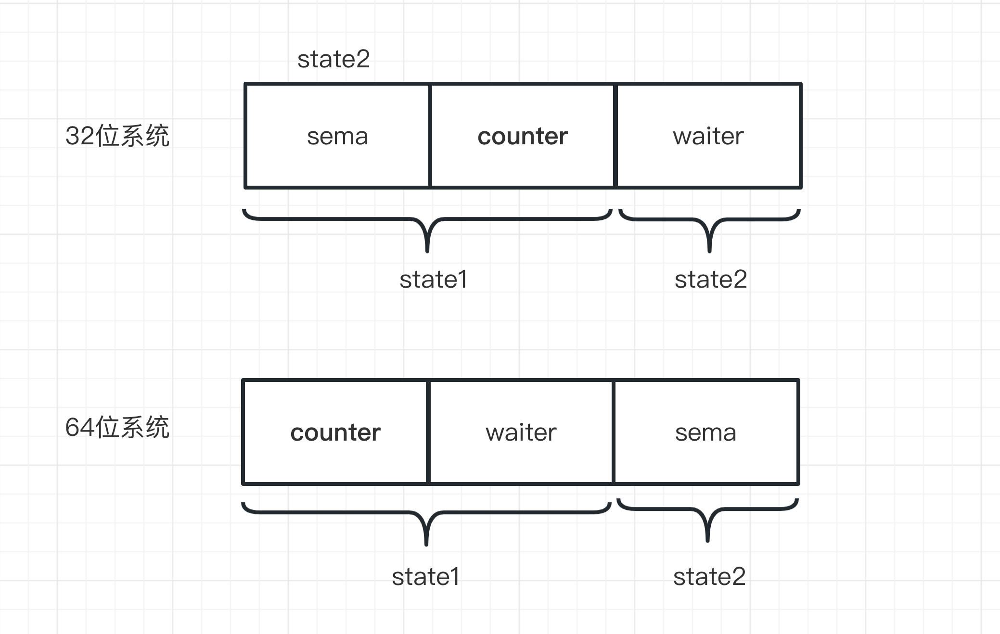

## 1. 概述

我们经常会使用多线程来加速大任务的处理，将大任务划分成多个子任务，每个子任务由一个单独的线程进行处理，各线程处理完后再统一进行合并。

golang针对这种场景提供了`WaitGroup`，通过该技术，主协程能够将任务划分给多个子协程并等待所有协程执行完毕后才继续执行。

比如下面的案例中，由两个协程对同一个数分别执行1000万次加一操作，为了模拟执行时延，每次加1后要sleep一段时间，最后由主协程合并两个协程的处理结果。

```golang
func main() {
	result := [2]int{}
	var wg sync.WaitGroup
	wg.Add(2)
	go increment(0, 0, &result, &wg)
	go increment(0, 1, &result, &wg)
	wg.Wait()
	fmt.Println(result[0] + result[1])
}

func increment(initial int, idx int, result *[2]int, wg *sync.WaitGroup) {
	for i := 0; i < 10000; i++ {
		initial = initial + 1
		time.Sleep(time.Microsecond)
	}
	result[idx] = initial
	wg.Done()
}
```

上述案例中，如果不使用`sync.WaitGroup`，主协程启动两个子协程后就不会等待，此时子协程可能还没来得及执行主协程就退出了，就会得到0这样的结果。

本文不讨论是否有其他的技术能够实现类似的效果，仅考虑`WaitGroup`的原理，包括:

* WaitGroup的实现原理
* 底层数据结构及性能优化手段
* 内部无锁操作是如何实现的

golang版本: `go version go1.19.4 linux/amd64`


## 2.WaitGroup结构及主要处理流程

该结构包含三个字段，定义如下:

```golang
type WaitGroup struct {
	noCopy noCopy
	state1 uint64
	state2 uint32
}
```

其中`noCopy`结构体和拷贝检测相关，对于包含`noCopy`结构的结构体，如果发生了复制操作，就可以用`go vet`工具检测出来。需要注意的是，即使发生了拷贝，在编译时也不会报错。

本质上，`noCopy`是`Locker`接口的一个实现，但是由于是非导出的，我们无法在代码中使用。如果我们想让某个接口是`不可拷贝`的，可以采用类似的方法自定义，如下:

```golang
type noCopy struct{}
func (*noCopy) Lock()   {}
func (*noCopy) Unlock() {}
```

之所以要避免拷贝，是因为这类接口通常要在同一个对象上配套使用，否则就可能出现死锁。

比如上述案例中`WaitGroup`的`Wait`和`Done`方法。如果我们在wg上执行Wait操作，然后将wg传递给increment方法，由于本质上是值拷贝，所以执行Done操作时实际是在另一个对象上执行的。这就会出现: 主协程阻塞在wg的Wait操作上，并永久等待子协程调用`Done`方法(实际上子协程永远也执行不到)。这也是为什么上述案例中传递wg时要使用指针的原因。

`state1`和`state2`两个字段分别是uint64和uint32类型的，这里有关于内存对齐和并发安全相关的考虑，为了便于理解，先简单地从功能上对这几个字段进行拆分，后面再考虑内存对齐和并发安全相关的部分。

从功能上可将这两个字段分拆为以下三个字段:

* counter: 尚未完成的计数。每调用一次`Add(n)`就加n，调用一次Done则减1
* waiter: 等待的协程数。每调用一次`Wait`就加1
* sema: 和信号量相关。这里用到了两个相关函数: runtime_Semacquire和runtime_Semrelease，分别用于增加和减少信号量。

拆成这三个字段后，相关处理流程如下:

* 主协程调用`wg.Add(n)`，将counter增加n
* 主协程调用`wg.Wait()`，此时子协程尚未运行完毕，waiter计数加1，调用`runtime_Semacquire`将信号量加1，主协程阻塞
* 子协程调用`wg.Done()`，counter计数减1。所有子协程执行完后，counter计数为0，调用`runtime_Semrelease`释放信号量，唤醒阻塞的协程。

## 3.Add操作

在启动子协程之前会调用Add方法，这里delta表示将启动的子协程的个数。实际上，delta还可以传入负数。代码逻辑如下:

```golang
func (wg *WaitGroup) Add(delta int) {
  // 获取状态计数器(包括上述counter和waiter)和信号量指针
	statep, semap := wg.state()
	...
  // 高32位加法(counter计数)
	state := atomic.AddUint64(statep, uint64(delta)<<32)
  // 高32位表示counter
	v := int32(state >> 32)
  // 低32位表示waiter
	w := uint32(state)
	...
  // counter小于0是非法计数
	if v < 0 {
		panic("sync: negative WaitGroup counter")
	}
	if w != 0 && delta > 0 && v == int32(delta) {
		panic("sync: WaitGroup misuse: Add called concurrently with Wait")
	}
  // counter大于0或waiter等于0，修改计数器后直接返回
	if v > 0 || w == 0 {
		return
	}

  // 执行到这里说明counter等于0且waiter大于0，说明所有的协程都已经执行完了
	if *statep != state {
		panic("sync: WaitGroup misuse: Add called concurrently with Wait")
	}
  // 重置计数，并通过信号量将所有等待的协程唤醒
	*statep = 0
	for ; w != 0; w-- {
		runtime_Semrelease(semap, false, 0)
	}
}
```

下面对上述逻辑中略过的对`state`方法的调用进行说明。

WaitGroup实现中并没有直接提供counter和waiter，而是提供了uint64类型的state1字段和uint32类型的state2字段。从对应关系上，state1和state2结构如下:



这里用了一个小trick。在64位对齐时，counter和waiter分别来自state1的高32位和低32位，sema来自state2；在32位对齐时，counter来自state1的低32位，waiter来自state2，sema来自state1的高32位。

```golang
func (wg *WaitGroup) state() (statep *uint64, semap *uint32) {
	if unsafe.Alignof(wg.state1) == 8 || uintptr(unsafe.Pointer(&wg.state1))%8 == 0 {
		// state1 is 64-bit aligned: nothing to do.
		return &wg.state1, &wg.state2
	} else {
		// state1 is 32-bit aligned but not 64-bit aligned: this means that
		// (&state1)+4 is 64-bit aligned.
		state := (*[3]uint32)(unsafe.Pointer(&wg.state1))
		return (*uint64)(unsafe.Pointer(&state[1])), &state[0]
	}
}
```

之所以这样，其实是和内存对齐有关系。

以uint64类型为例，对于该类型的变量，在32位系统上会进行4字节对齐，而在64位系统上会进行8字节对齐。

由于CPU在取数据时是按照字长为单位的(32位系统字长为4字节，64位系统字长为8字节)。因此在64位系统上操作该类型的变量，由于刚好对齐到一个数据块上，一次原子操作就能取到。而对于32位系统，由于是分散在两个数据块，如果要保证原子性，需要手动将该字段进行64位对齐。

在64位对齐时，state1本身就是8字节的，因此直接取出作为state即可。而在32位对齐时，为了保证操作8字节数据的原子性，将state1的低32位和state2的高32位作为一个uint64类型来处理(即state)，state1的高32位就可以作为padding，这就类似于如下定义:

```golang
type Data struct {
	padding uint32
	state   uint64
}

func main() {
  fmt.Println(unsafe.Offsetof(Data{}.state))
}
// 8
```

## 4.Done操作

子协程完成后调用Done函数，会将counter计数减1，如果counter计数变为0，还会唤醒等待的协程。这里复用了Add操作。

```golang
func (wg *WaitGroup) Done() {
	wg.Add(-1)
}
```

## 5.Wait操作

该操作的核心逻辑是: 基于原子操作将waiter计数加1，如果counter计数不为0，则尝试获取信号量。显然这里会阻塞，因为信号量为0。

```golang
func (wg *WaitGroup) Wait() {
	statep, semap := wg.state()
  ...
  // 自旋，如果一次操作失败会重复尝试
	for {
		state := atomic.LoadUint64(statep)
		v := int32(state >> 32)
		w := uint32(state)
    // counter为0，不需要等待
		if v == 0 {
      ...
			return
		}
		// counter不为0，此时将waiter计数加1
		if atomic.CompareAndSwapUint64(statep, state, state+1) {
			...
      // 阻塞
			runtime_Semacquire(semap)
			...
			return
		}
	}
}
```

## 6.总结

WaitGroup是一个很有用的工具，其实现原理包括以下几点:

* 通过原子操作记录启动的协程数和等待的协程数
* 通过信号量操作达到阻塞/唤醒协程的目的
* 通过空的Locker接口实现(noCopy)引入复制检查功能
* 通过改变字段的顺序保证安全的原子操作所需的内存对齐要求


