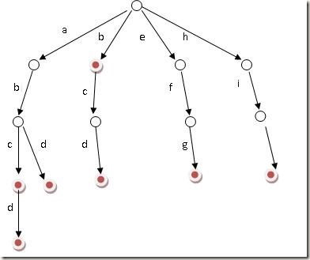

## 1. 序言

gin框架是golang中比较常见的web框架，截止到目前(2023-03-21)，github上已经累计了67.3K的star数，这足以表明其优秀。作为一名想要知其然亦想知其所以然的程序员，希望通过学习gin框架的实现原理来提高自己的技术能力，也希望通过分享来帮助想要进行学习的同学。

框架源码地址: https://github.com/gin-gonic/gin

版本: v1.8.2

## 2. 前置知识

其实golang本身的标准库已经足以实现简单的web服务，但是出于以下原因，使得直接使用标准库开发难以满足我们的需求:

1. 标准库本身提供了比较简单的路由注册能力，只支持精确匹配，而实际开发时难免会遇到需要使用通配、路径参数的场景
2. 标准库暴露给开发者的函数参数是`(w http.ResponseWriter, req *http.Request)`，这就导致我们需要直接从请求中读取数据、反序列化，响应时手动序列化、设置Content-Type、写响应内容，比较麻烦
3. 有时候我们希望能够在不过多地侵入业务的前提下，对请求或响应进行一些前置或后置处理。直接基于标准库开发，业务和非业务代码难免会耦合在一起

下面是直接使用标准库开发一个简单的获取当前时间的案例，当客户端以`GET`方法请求路径`/time`时，服务端以json方式返回当前时间，格式为: `{"time": "xxx"}`.

```golang
func main() {
	http.HandleFunc("/time", func(w http.ResponseWriter, r *http.Request) {
		w.WriteHeader(http.StatusOK)
		w.Header().Set("Content-Type", "application/json")
		tim := map[string]string{
			"time": time.Now().Format("2006-01-02"),
		}
		byts, err := json.Marshal(tim)
		if err != nil {
			panic(err)
		}
		w.Write(byts)
	})
	http.ListenAndServe("0.0.0.0:8080", nil)
}
```
由此我们能得到基于`net/http`开发web服务的一般流程:

1. 利用`http.HandleFunc`函数注册路由，并指定处理函数，函数签名为`func(w http.ResponseWriter, r *http.Request)`
2. 在处理函数内部获取查询参数、路径参数、读取请求体并反序列化
3. 业务逻辑处理
4. 错误处理(设置错误响应状态码、错误信息等)
5. 设置响应状态码、设置响应头(如Content-Type)、处理结果序列化并写入响应体
6. 调用`http.ListenAndServer`进行端口监听

操作起来略有不便，如步骤2、4、5，对每个请求基本都是通用的，每次都写一遍很麻烦。为了解决这个问题，gin框架在标准库的基础上进行了一些封装。下面基于gin框架实现上述需求:

```golang
func main() {
	mux := gin.Default()
	mux.GET("/time", func(c *gin.Context) {
		m := map[string]string{
			"time": time.Now().Format("2006-01-02"),
		}
		c.JSON(http.StatusOK, m)
	})
	err := mux.Run("0.0.0.0:8080")
	if err != nil {
		panic(err)
	}
}
```

基于gin开发的一般流程可总结为:

1. 创建gin.Engine、注册middleware
2. 注册路由，编写处理函数，在函数内通过gin.Context获取参数，进行逻辑处理，通过gin.Context暴露的方法(如JSON())写回输出
3. 监听端口

可以看到简洁了很多，不用再关注响应内容的序列化和状态码问题了。

gin框架自身也是基于标准库`net/http`开发的，很多功能实现都是在标准库的基础上进行的封装，因此本文在剖析gin框架的过程中，点到为止，不会过多的对标准库的细节进行说明(后续会专门学习标准库的源码)。

## 3. 路由注册流程

### 3.1 核心数据结构

从案例中可知，使用gin开发前需要先调用`gin.Default()`函数，该函数返回一个`*gin.Engine`对象，该对象就是gin中的一个核心对象。

```golang
func Default() *Engine {
	debugPrintWARNINGDefault()
	engine := New()
	engine.Use(Logger(), Recovery())
	return engine
}
```

其实是先调用New方法创建了Engine对象，再调用Use注册middleware，这里先忽略。

#### (1) gin.Engine

```golang
func New() *Engine {
  ...
	engine := &Engine{
		// NOTE: 实例化RouteGroup，路由管理相关(Engine自身也是一个RouterGroup)
		RouterGroup: RouterGroup{
			Handlers: nil,
			basePath: "/",
			root:     true,
		},
		...
		// NOTE: 负责存储路由和处理方法的映射，采用类似字典树的结构(这里构造了几棵树，每棵树对应一个http请求方法)
		trees:            make(methodTrees, 0, 9),
		...
	}
  ...
	// NOTE: 基于sync.Pool实现的context池，能够避免context频繁销毁和重建
	engine.pool.New = func() any {
		return engine.allocateContext(engine.maxParams)
	}
	return engine
}
```

该结构中包含三个核心对象:

* RouterGroup: 路由组，和路由管理相关
* 路由树数组trees: 标准库本身的路由是不区分请求方法的，也就是说注册一个路由后，GET、POST都能匹配到该路由。这显然不是我们想要的，我们希望的是同一个路由在不同的请求方法下，由不同的逻辑进行处理。其实就是通过路由树实现的，gin的针对每个请求方法都有一棵路由树
* context对象池: gin.Context是gin框架暴露给开发的另一个核心对象，可以通过该对象获取请求信息，业务处理的结果也是通过该对象写回客户端的。为了实现context对象的复用，gin基于sync.Pool实现了对象池

如果了解golang的http标准库，应该知道: `http.ListenAndServe`函数的第二个参数是一个接口类型，只要实现了该接口的`ServeHTTP(ResponseWriter, *Request)`方法，就能够对请求进行自定义处理。

```golang
type Handler interface {
	ServeHTTP(ResponseWriter, *Request)
}
```

gin.Engine对象其实就是该接口的一个实现，因为它实现了该方法。至于具体处理过程，后续会详细说明。

```golang
func (engine *Engine) ServeHTTP(w http.ResponseWriter, req *http.Request) {
  ...
}
```

#### (2) 路由组RouterGroup

路由组的目的是为了实现配置的复用。

比如有一组对food的请求: /food/add、/food/query、/food/update等，我们希望在注册路由时尽量简单(不要每次都写/food)，并且与food相关的请求使用一组单独的middleware(与其他对象的请求隔离开)，这时候就可以使用路由组。

下面是其定义: 

```golang
type RouterGroup struct {
	// 路由组处理函数链，其下路由的函数链将结合路由组和自身的函数组成最终的函数链
	Handlers HandlersChain
	// 路由组的基地址，一般是其下路由的公共地址
	basePath string
	// 路由组所属的Engine，这里构成了双向引用
	engine *Engine
	// 该路由组是否位于根节点，基于RouterGroup.Group创建路由组时此属性为false
	root bool
}
```

需要注意的是gin.Engine对象本身就是一个路由组。

#### (3) 处理器链 HandlersChain

上述路由组对象中有一个很重要的字段，即Handlers，用于收集该路由组下注册的middleware函数。在运行时，会按顺序执行HandlersChain中的注册的函数。

```golang
type HandlerFunc func(*Context)

// HandlersChain defines a HandlerFunc slice.
// NOTE: 路由处理函数链，运行时会根据索引先后顺序依次调用
type HandlersChain []HandlerFunc
```

### 3.2 执行流程

一般情况下使用gin框架开发时使用默认的engine即可，因为相对于直接使用gin.New()创建Engine对象，它只是多注册了两个中间件。

下面是一般流程:

1. 创建并初始化Engine对象
2. 注册middleware
3. 注册路由及处理函数
4. 服务端口监听

下面详细说明

### 3.3 创建并初始化gin.Engine

我们调用gin.Default创建一个默认的gin.Engine对象，其实际上会调用gin.New

```golang
func New() *Engine {
  ...
	engine := &Engine{
		// NOTE: 实例化RouteGroup，路由管理相关(Engine自身也是一个RouterGroup)
		RouterGroup: RouterGroup{
			Handlers: nil,
			basePath: "/",
			root:     true,
		},
		...
		// NOTE: 负责存储路由和处理方法的映射，采用类似字典树的结构(这里构造了几棵树，每棵树对应一个http请求方法)
		trees:            make(methodTrees, 0, 9),
		...
	}
  ...
	// NOTE: 基于sync.Pool实现的context池，能够避免context频繁销毁和重建
	engine.pool.New = func() any {
		return engine.allocateContext(engine.maxParams)
	}
	return engine
}
```

对以下对象进行初始化:

1. 创建根路径下的路由组
2. 创建九棵路由树
3. 初始化context对象池

### 3.4 注册middleware

`gin.Default`调用`gin.New`创建`gin.Engine`后，紧接着就会调用`gin.Use`函数进行middleware的注册。默认会注册`Logger()`和`Recovery()`这两个中间件函数。

```golang
func (engine *Engine) Use(middleware ...HandlerFunc) IRoutes {
	// NOTE: 将注册的中间件添加到RouterGroup的Handlers处理函数链中
	engine.RouterGroup.Use(middleware...)
	engine.rebuild404Handlers()
	engine.rebuild405Handlers()
	return engine
}

func (group *RouterGroup) Use(middleware ...HandlerFunc) IRoutes {
	group.Handlers = append(group.Handlers, middleware...)
	return group.returnObj()
}
```

注册中间件其实就是将中间件处理函数添加到`HandlersChain`结构(HandlerFunc切片)中


### 3.5 注册路由及处理函数

```golang
mux.GET("/time", func(c *gin.Context) {
  m := map[string]string{
    "time": time.Now().Format("2006-01-02"),
  }
  c.JSON(http.StatusOK, m)
})
```

以我们的案例中的GET为例，这里的GET方式其实是`gin.Engine`对象的方法。

除了GET，http协议中的九个请求方法都在该对象中有一个同名的实现，这九个方法都是通过调用`RouterGroup.handle`方法实现的。

```golang
func (group *RouterGroup) POST(relativePath string, handlers ...HandlerFunc) IRoutes {
	return group.handle(http.MethodPost, relativePath, handlers)
}

// GET is a shortcut for router.Handle("GET", path, handlers).
func (group *RouterGroup) GET(relativePath string, handlers ...HandlerFunc) IRoutes {
	return group.handle(http.MethodGet, relativePath, handlers)
}
...
```

下面是`handle`方法的定义，该方法主要做了以下几件事:

1. 拼接完整的路径参数
2. 组合处理函数链
3. 注册完成路径及处理函数链到路由树

```golang
func (group *RouterGroup) handle(httpMethod, relativePath string, handlers HandlersChain) IRoutes {
	// 将路由组的基地址和传入的相对地址组合成绝对路径
	absolutePath := group.calculateAbsolutePath(relativePath)
	// 将路由组的处理函数链和当前路由的处理函数组合成完成的处理函数链
	handlers = group.combineHandlers(handlers)
	// 将路由及其对应的处理函数链添加到路由树中
	group.engine.addRoute(httpMethod, absolutePath, handlers)
	return group.returnObj()
}
```

#### (1) 拼接完整的路径参数

这个很好理解，上面说过使用路由组之后，注册路由时不用每次都写前缀。比如/food/add、/food/query、/food/update这几个，路由组的路径是/food，基于该路由组注册路由时只需要注册/add、/query、/update就行了。其实就是在这里进行拼接的。

```golang
func (group *RouterGroup) calculateAbsolutePath(relativePath string) string {
	return joinPaths(group.basePath, relativePath)
}

func joinPaths(absolutePath, relativePath string) string {
	if relativePath == "" {
		return absolutePath
	}

	finalPath := path.Join(absolutePath, relativePath)
	if lastChar(relativePath) == '/' && lastChar(finalPath) != '/' {
		return finalPath + "/"
	}
	return finalPath
}
```

####  (2) 组合处理函数链

我们可以针对每个路由组单独设置middleware，实际执行时会先执行注册的中间件，最后才执行注册的业务处理函数。实现上，则是将路由组中注册的中间件和业务处理函数组合在一起。由于是按照顺序append到切片中的，所以执行顺序其实就是注册顺序。

```golang
func (group *RouterGroup) combineHandlers(handlers HandlersChain) HandlersChain {
	// 构造新的切片，其长度为路由组过滤器链长度 + 路由的处理链长度
	finalSize := len(group.Handlers) + len(handlers)
	// 这里要求处理器链的长度最大为63，超过此长度注册路由会失败(Abort就是通过设置Index为63来提前中断处理器链的执行的)
	assert1(finalSize < int(abortIndex), "too many handlers")
	mergedHandlers := make(HandlersChain, finalSize)
	// 深拷贝路由组处理器链
	copy(mergedHandlers, group.Handlers)
	// 深拷贝路由处理器链
	copy(mergedHandlers[len(group.Handlers):], handlers)
	return mergedHandlers
}
```

#### (3) 注册完成路径及处理函数链到路由树

前面说过gin针对每个http请求方法，都构造了一棵路由树。这里就需要根据注册路由的请求方法获取对应的路由树，再将路由的完整路径和对应的处理函数链注册到路由树中，后续才能根据请求路径调用对应的处理函数链进行处理。

```golang
func (engine *Engine) addRoute(method, path string, handlers HandlersChain) {
  ...
	// 每个请求方法(GET/POST...)都对应一棵前缀树，这里获取当前方法的前缀树
	root := engine.trees.get(method)
	// 首次添加此方法的路由，构造前缀树
	if root == nil {
		root = new(node)
		root.fullPath = "/"
		engine.trees = append(engine.trees, methodTree{method: method, root: root})
	}
	// 将路由的绝对路径和对应的完整处理函数链添加到路由树
	root.addRoute(path, handlers)
  ...
}
```

这里只需要先知道，路由树是用压缩前缀树实现的，由于比较复杂，后面再讲。

### 3.6 服务端口监听

前面已经完成了接收请求前的准备工作，现在只差一步，即调用`Engine.Run`进行端口监听即可。

```golang
func (engine *Engine) Run(addr ...string) (err error) {
	defer func() { debugPrintError(err) }()
  ...
	err = http.ListenAndServe(address, engine.Handler())
	return
}
```

## 4. 请求处理

在3.1 - (1)中有说，由于Engine实现了`http.ServeHTTP`方法，所以http标准库收到请求后，对请求的处理入口其实就是`Engine.ServeHTTP`方法。

```golang
func (engine *Engine) ServeHTTP(w http.ResponseWriter, req *http.Request) {

	c := engine.pool.Get().(*Context)
	c.writermem.reset(w)
	c.Request = req
	c.reset()

	engine.handleHTTPRequest(c)

	engine.pool.Put(c)
}
```

其核心处理处理逻辑如下:

1. 从context对象池取一个可用的context对象，后续交互就是靠这个对象完成的
2. 将`http.ResponseWriter`和`http.Request`对象保存到context中。我们通过context获取请求参数、写入响应，其实是因为其底层封装了这两个对象的方法
3. 调用Engine的`handleHTTPRequest`方法，对请求进行处理。注意到其参数已经变成了`gin.Context`了。
4. 请求处理完毕，回收context，以便下次复用。

下面来看`handleHTTPRequest`的具体实现:

```golang
func (engine *Engine) handleHTTPRequest(c *Context) {
	httpMethod := c.Request.Method
	rPath := c.Request.URL.Path
	...
	// Find root of the tree for the given HTTP method
	t := engine.trees
	for i, tl := 0, len(t); i < tl; i++ {
		// 根据http请求方法获取对应的路由树
		if t[i].method != httpMethod {
			continue
		}
		root := t[i].root
		// Find route in tree
		// 根据请求路径获取路由树节点信息，包括处理器链和路径
		value := root.getValue(rPath, c.params, c.skippedNodes, unescape)
		if value.params != nil {
			c.Params = *value.params
		}
		// 将处理器链注入到context中
		if value.handlers != nil {
			c.handlers = value.handlers
			c.fullPath = value.fullPath
			// NOTE: 开启 handlers 链的遍历调用流程
			c.Next()
			c.writermem.WriteHeaderNow()
			return
		}
		...
		break
	}
  ...
}
```

前面讲到过，gin为每一个http请求方法创建了一棵路由树，每棵树保存了完整的路由路径和对应的处理器链。所以这部分逻辑其实是: 

1. 根据当前客户端的请求方法，获取到对应的路由树。
2. 根据请求的路径在路由树中进行路径匹配，能够获取到路径参数和该路由的完整处理器链(包括预先设置的middleware处理函数)，并保存到context对象中。有关路由树匹配的细节将在下一章节详细讲解。
3. 调用`c.Next()`，其实是开始按顺序调用处理器链中的每一个处理器，对请求进行处理。
4. 一般情况下，会在业务处理函数中调用context暴露的方法将响应写入到http输出流中。但是如果没调用，这里会帮忙做这件事(`WriteHeaderNow`)，给客户端一个响应。代码如下:


```golang
func (w *responseWriter) WriteHeaderNow() {
	if !w.Written() {
		w.size = 0
		w.ResponseWriter.WriteHeader(w.status)
	}
}

func (w *responseWriter) Written() bool {
	return w.size != noWritten
}
```

上面说过，注册处理器时，会将所属RouterGroup注册的中间件函数和路由处理器组合在一个切片中。

由于采用的是append操作，所以注册的顺序就是实际执行的顺序。

正常情况下，注册的处理器会依次执行，通过context中的`index`字段控制执行进度，比如想要对请求进行一系列的前置操作。

也可以通过在处理器中调用`c.Next()`提前进入下一个处理器，待其执行完后再返回到当前处理器，这种比较适合需要对请求做前置和后置处理的场景，如请求执行时间统计。


```golang
func (c *Context) Next() {
	c.index++
	for c.index < int8(len(c.handlers)) {
		c.handlers[c.index](c)
		c.index++
	}
}
```

有时候我们可能会希望，某些条件触发时直接返回，不再继续后续的处理操作。Context提供了`Abort`方法帮助我们实现这样的目的。这也是通过index字段实现的，gin中要求一个路由的全部处理器个数不超过63，每次执行一个处理器时，会先判断index是否超过了这个限制，如果超过了就不会执行。如下:

```golang
func (c *Context) Abort() {
	c.index = abortIndex
}

const abortIndex int8 = math.MaxInt8 >> 1
```

## 5. 请求绑定和响应渲染

基于标准库开发时，我们可以从请求体中以字节流的方式读取请求内容，也可以将内容以字节流的方式写回去。但是会比较麻烦，

请求时我们需要基于请求的数据格式，决定应该怎样反序列化输入流、自己实现数据校验。

响应时，需要自己去序列化响应结构、设置content-type、写入响应流。

这几个过程不仅重复，而且需要多次判断error，最好是交给框架来做这件事，从而将开发的注意力集中在业务逻辑上。

### 5.1. 请求绑定

问题在于，从请求中读取的数据应该以什么类型组织呢，是string、int还是某个自定义的结构体？

为此gin提供了一系列的方式，用于从请求中获取参数和数据等信息，如常用的`ShoudBindJson`。

```golang
func (c *Context) ShouldBindJSON(obj any) error {
	return c.ShouldBindWith(obj, binding.JSON)
}

func (c *Context) ShouldBindWith(obj any, b binding.Binding) error {
	return b.Bind(c.Request, obj)
}
```

这里`binding.Binding`是一个接口，所有用于实现请求数据绑定的类型都应该实现这个接口。如上述调用的是`jsonBinding`，最终会使用json包的反序列化方法进行反序列化。

```golang
func (jsonBinding) Bind(req *http.Request, obj any) error {
	if req == nil || req.Body == nil {
		return errors.New("invalid request")
	}
	return decodeJSON(req.Body, obj)
}

func decodeJSON(r io.Reader, obj any) error {
	decoder := json.NewDecoder(r)
	if EnableDecoderUseNumber {
		decoder.UseNumber()
	}
	if EnableDecoderDisallowUnknownFields {
		decoder.DisallowUnknownFields()
	}
	if err := decoder.Decode(obj); err != nil {
		return err
	}
	return validate(obj)
}
```

反序列化完毕后，还涉及输入内容的校验，哪些字段必填、长度是否固定等，如果我们要在程序中判断，会比较繁琐。我们一般会采用 [https://github.com/go-playground/validator](https://github.com/go-playground/validator) 这个库的实现。实际上，gin也是基于这个库实现的。

```golang

var Validator StructValidator = &defaultValidator{}

type defaultValidator struct {
	once     sync.Once
	validate *validator.Validate
}

func validate(obj any) error {
	if Validator == nil {
		return nil
	}
	return Validator.ValidateStruct(obj)
}
```

### 5.2 响应渲染

除了文章开头案例中提到的`JSON`方法，gin还提供了针对以下类型的的处理方法:

```shell
├── any.go
├── data.go
├── html.go
├── json.go
├── msgpack.go
├── protobuf.go
├── reader.go
├── redirect.go
├── render.go
├── text.go
├── toml.go
├── xml.go
└── yaml.go
```

以`context.JSON`方法为例:

```golang
func (c *Context) JSON(code int, obj any) {
	c.Render(code, render.JSON{Data: obj})
}

func (c *Context) Render(code int, r render.Render) {
	c.Status(code)

	if !bodyAllowedForStatus(code) {
		r.WriteContentType(c.Writer)
		c.Writer.WriteHeaderNow()
		return
	}

	if err := r.Render(c.Writer); err != nil {
		// Pushing error to c.Errors
		_ = c.Error(err)
		c.Abort()
	}
}
```

首先调用`Status`设置状态码，然后调用`r.Render`进行渲染。

```golang
func (c *Context) Status(code int) {
	c.Writer.WriteHeader(code)
}
```

这里r是一个接口类型，该类型用于对所有响应内容的方法进行抽象。需要实现的方法包括: 

* Render: 渲染方法，用于将响应内容写入到`http.ResponseWriter`中
* WriteContentType: 用于设置响应头中的Content-Type

```golang
type Render interface {
	// Render writes data with custom ContentType.
	Render(http.ResponseWriter) error
	// WriteContentType writes custom ContentType.
	WriteContentType(w http.ResponseWriter)
}
```

以JSON类型为例。

`Render`其实就是基于json库将相应结构体序列化为字节数据，再写入`http.ResponseWriter`中。

```golang
func (r JSON) Render(w http.ResponseWriter) error {
	return WriteJSON(w, r.Data)
}

func WriteJSON(w http.ResponseWriter, obj any) error {
	writeContentType(w, jsonContentType)
	jsonBytes, err := json.Marshal(obj)
	if err != nil {
		return err
	}
	_, err = w.Write(jsonBytes)
	return err
}
```

`WriteContentType`则是直接将响应头设置为`application/json`.

```golang
jsonContentType      = []string{"application/json; charset=utf-8"}

func writeContentType(w http.ResponseWriter, value []string) {
	header := w.Header()
	if val := header["Content-Type"]; len(val) == 0 {
		header["Content-Type"] = value
	}
}
```

## 6. 核心数据结构

### 6.1 `gin.Context`

`gin.Context`是我们基于gin框架业务开发时最常接触到的结构。

该结构是一个context.Context实现，因此可以将该结构传递到所有接收context.Context的方法或函数中。

```golang
type Context struct {
	writermem responseWriter
	Request   *http.Request  // http请求
	Writer    ResponseWriter // http响应输出流

	Params   Params // URL路径参数
	handlers HandlersChain   // 处理器链
	index    int8 // 当前的处理进度，即处理链路处于函数链的索引位置
	fullPath string

	engine       *Engine
  ...
	mu sync.RWMutex // 用于保护 map 的读写互斥锁

	// 提供对外暴露的 Get 和 Set 接口向用户提供了共享数据的存取服务，相关操作都在读写锁的保护之下，能够保证并发安全
	Keys map[string]any // 缓存 handlers 链上共享数据的 map，由于使用的map，避免了设置多个值时context形成链表

  ...
	queryCache url.Values // 查询参数缓存，使用时调用`Request.URL.Query()`，该方法每次都会对原始的查询字符串进行解析，所以这里设置缓存避免冗余的解析操作

	formCache url.Values // 表单参数缓存，作用同上
  ...
}
```

由于封装了`http.Request`和`ResponseWriter`(内部是http.ResponseWriter)对象，因此可以通过context对http请求响应进行操作。

context中还封装了处理器链HandlersChain和当前处理位置索引，因此可以很方便地访问处理器。

另外，我们知道，context能够以链表形式存储值(也就是说每个k-v会对应一个context，这些context之间之间以链表形式连接)，当存在大量值时，访问效率比较低。因此gin.context在内部有一个`map[string]any`结构专门用于保存这些值，并且提供了线程安全访问方法。

```golang
func (c *Context) Set(key string, value any) {
	c.mu.Lock()
	defer c.mu.Unlock()
	if c.Keys == nil {
		c.Keys = make(map[string]any)
	}

	c.Keys[key] = value
}

// Get returns the value for the given key, ie: (value, true).
// If the value does not exist it returns (nil, false)
func (c *Context) Get(key string) (value any, exists bool) {
	c.mu.RLock()
	defer c.mu.RUnlock()
	value, exists = c.Keys[key]
	return
}
```

针对需要用到表单参数和查询字符串参数的场景，gin.Context进行了优化，设计了两个缓存结构(即`queryCache`和`formCache`)来提高重复访问时的效率。以表单参数为例:

```golang
func (c *Context) PostForm(key string) (value string) {
	value, _ = c.GetPostForm(key)
	return
}

func (c *Context) GetPostForm(key string) (string, bool) {
	if values, ok := c.GetPostFormArray(key); ok {
		return values[0], ok
	}
	return "", false
}

func (c *Context) PostFormArray(key string) (values []string) {
	values, _ = c.GetPostFormArray(key)
	return
}

func (c *Context) GetPostFormArray(key string) (values []string, ok bool) {
	c.initFormCache()
	values, ok = c.formCache[key]
	return
}

func (c *Context) initFormCache() {
	if c.formCache == nil {
		c.formCache = make(url.Values)
		req := c.Request
		// 从这里可以看出，如果不使用缓存，则每次都会解析请求，效率较低
		if err := req.ParseMultipartForm(c.engine.MaxMultipartMemory); err != nil {
			if !errors.Is(err, http.ErrNotMultipart) {
				debugPrint("error on parse multipart form array: %v", err)
			}
		}
		c.formCache = req.PostForm
	}
}
```

通过这样两个缓存结构，避免每次请求时都调用`net/http`库的方法。

### 6.2 前缀树

#### 6.2.1 前缀树

前缀树也称Trie树或字典树，是一种基于字符串公共前缀构建树形结构，来降低查询时间和提高效率的目的。前缀树一般用于统计和排序大量的字符串，其核心思想是空间换时间。

前缀树有三个重要特性:

* 根节点不包含字符，除根节点外每一个节点都只包含一个字符。
* 从根节点到某一节点路径上所有字符连接起来，就是该节点对应的字符串。
* 每个节点任意子节点包含的字符都不相同。

如下是普通前缀树的结构:



#### 6.2.2 压缩前缀树

上述前缀树实现起来比较简单，但是在空间利用上并不高效，因此有压缩前缀树。不同之处在于，压缩前缀树会对节点进行压缩，可以简单认为如果某一个节点是其父节点的唯一子节点，则会与父节点合并。


gin框架就采用的是压缩前缀树实现。

我们一般会将前缀树与哈希表结构进行对比，实际上标准库采用的就是哈希表实现。哈希表实现简单粗暴，但是有一些缺点，不太适合作为通用的路由结构。如:

1. 哈希表实现只支持简单的路径，不支持路径参数和通配
2. 路由的数量一般是有限的，使用map的优势并不明显
3. 哈希表需要存储完整的路径，相比较而言前缀树存储公共前缀只需要一个节点，空间效率更高

#### 6.2.3 代码实现

前面说过，gin针对每一个http请求方法，都构造了一棵前缀树，即:

```golang
type methodTree struct {
	method string
	root   *node // 该方法对应的路由树的根节点
}
```

其中`method`即http请求方法，`root`则是指向对应前缀树根节点的指针，`node`结构是前缀树的节点。

```golang
type node struct {
	path string
	indices string
	wildChild bool
	nType nodeType
	priority uint32
	handlers HandlersChain
	fullPath string
}
```
上述字段含义如下:

* path: 节点路径(不包含父节点)
* children: 子节点数组
* indices: 子节点数组中每个节点path的首字母
* wildChild: 是否存在通配类型的子节点
* nType: 节点类型，包括root(根节点)、static(静态节点)、catchAll(通配符*匹配的节点)、param(参数节点，即带:的节点)
* priority: 根据经过节点的路由数确定的节点优先级。同一个节点下的子节点会按照节点优先级降序排序，匹配时按序遍历children。优先级越高，越先被匹配。
* handlers: 处理器链
* fullPath: 完整路径(路由树结构中根节点到当前节点的路径上的全部path的完整拼接)

如下是有关优先级的一部分代码:

```golang
func (n *node) incrementChildPrio(pos int) int {
	// 子节点数组
	cs := n.children
	// 增加对应的子节点的优先级
	cs[pos].priority++
	prio := cs[pos].priority

	// 调整节点位置，确保整个子节点数组是按照优先级倒序排列的，从而优先级更大的节点会被优先匹配
	newPos := pos
	for ; newPos > 0 && cs[newPos-1].priority < prio; newPos-- {
		// Swap node positions
		cs[newPos-1], cs[newPos] = cs[newPos], cs[newPos-1]
	}

	// 调整前缀字符串，确保每个字母和子节点数组路径的首字母一致
	if newPos != pos {
		n.indices = n.indices[:newPos] + // Unchanged prefix, might be empty
			n.indices[pos:pos+1] + // The index char we move
			n.indices[newPos:pos] + n.indices[pos+1:] // Rest without char at 'pos'
	}

	return newPos
}
```

压缩前缀树部分是gin框架中最复杂的代码，出于篇幅原因这里只说明其中一部分，我在代码仓库中做了更详尽的注释。

[看这里](https://github.com/amosir/gin-study)

> 如果有同学愿意一起学习gin的代码，也可以补充注释后给我的仓库提MR


