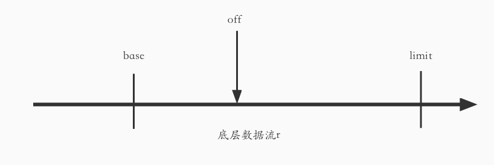

## 1.1 概览

io 包提供对 I/O 原语操作的基本接口

主要任务是对这些原语操作的已有实现进行封装(比如 os 包中的)

> 默认情况下这些操作非并发安全

## 1.2 核心接口

核心接口有两个，即 Reader 接口和 Writer 接口

### 1.2.1 Reader 接口

该接口定义如下

```Go
type Reader interface {
  Read(p []byte) (n int, err error)
}
```

从源码中能够得知:

- 只有一个 Read 方法，任何类型只要实现了 Read 方法就实现了该接口。
- Read 方法能将**至多 len(p)个字节**读取到切片 p 中，并返回实际读取的字节数 n
  - 即使数据少于 len(p)字节，也会占用全部 len(p)个字节的长度
  - 数据不足时直接返回能读取到的数据，**不会等待**
- 成功读取 n 个字节后出现了 error 或者 EOF，有两种处理方式:
  - 在本次调用中返回 error
  - 在下次调用时返回 error，并且 n = 0
- 调用时应当总是先处理读取到的字节，再处理错误

### 1.2.2 Writer 接口

该接口定义如下:

```Go
type Writer interface {
  Write(p []byte) (n int, err error)
}
```

同样只有一个 Write 方法，通过源码的注释能够知道:

- 该方法能够将切片 p 中的数据写到底层数据流中，并返回实际写入的字节数
- 如果 n 小于 len(p)，则必须返回一个 error(非 nil)
- Write 方法不能修改 p 中的数据，即使是临时修改

### 1.2.3 Closer 接口

该接口定义如下:

```Go
type Closer interface {
  Close() error
}
```

只包含一个 Close 方法，用于关闭数据流，通常在 defer 中被调用

### 1.2.4 Seeker 接口

接口定义如下:

```Go
type Seeker interface {
  Seek(offset int64, whence int) (int64, error)
}

// whence可取的值
const (
  SeekStart   = 0
  SeekCurrent = 1
  SeekEnd     = 2
)

```

从源码注释中可知:

- 该接口只有一个 Seek 方法，用于设置下次读或写操作的位置
- 位置计算由 offset 和 whence 参数共同确定:
  - SeekStart，表示从文件头定位
  - SeekCurrent: 表示从当前位置定位
  - SeekEnd: 表示从文件尾定位
- Seek 方法将返回重新定位后**新位置距离文件头的偏移量**

### 1.2.5 ReaderFrom 和 WriterTo 接口

从接口名可知这两个接口是对应的。

注释中一直提到这两个接口会在 io.Copy 函数中使用，后面在该函数中会讲到

通过这一对接口可以实现: 将数据从一个地方读取或者写入到另一个地方

#### (1) **ReaderFrom 接口**

下面是该接口的定义:

```Go
type ReaderFrom interface {
  ReadFrom(r Reader) (n int64, err error)
}
```

从源码注释可知:

- 该方法从 r 中读取数据，并返回读取的字节数
- 方法返回一个读取过程中遇到的 error，但是**不会返回 EOF**

#### (2) WriterTo 接口

下面是该接口的定义:

```Go
type WriterTo interface {
  WriteTo(w Writer) (n int64, err error)
}
```

从源码注释可知:

- 该方法向 w 中写入数据，并返回写入的字节数
- 写入过程中遇到的错误也会被返回

### 1.2.6 WriterAt 和 ReaderAt 接口

同样两个接口也是对应的

#### (1) WriterAt 接口

接口定义如下:

```Go
type WriterAt interface {
  WriteAt(p []byte, off int64) (n int, err error)
}
```

从源码注释可知:

- 该方法将切片 p 中的数据写入到底层数据流中，从 off 位置开始写入
- 方法返回实际写入的字节数和遇到的 error，并且如果 n < len(p)则必须返回非 nil 的 error
- 如果待写入的目标设置了 seek 偏移量，那么不能影响底层的 seek 偏移量，也不能被 seek 偏移量影响
- 如果写入的位置没有重叠，那么可以并行地对同一个目标调用

#### (2) ReaderAt 接口

定义如下:

```Go
type ReaderAt interface {
  ReadAt(p []byte, off int64) (n int, err error)
}
```

从源码注释可知:

- 该方法从底层数据源的位置 off 处读取 len(p)字节到切片 p 中，返回读取的字节数和一个错误
- n < len(p)必须返回一个非 nil 的 error，说明原因
- 数据不足时，该函数会**阻塞**直到数据可读或遇到错误
- n == len(p)并且遇到 EOF 时，可能返回 err == EOF，也可能返回 err == nil
- 如果读取目标设置了 seek 偏移量，那么不能影响底层的 seek 偏移量，也不能被 seek 偏移量影响
- ReadAt 可以并行调用

## 1.3 组合接口

主要是上述前四个接口的组合，包括

ReadCloser

WriteCloser

ReadWriteCloser

ReadSeeker

WriteSeeker

ReadWriteSeeker

ReadWriter

这几个接口就是简单的接口组合，有的时候需要几个接口的功能，就可以通过小接口组合成大接口的方式实现。

## 1.4 其它接口

### 1.4.1 ByteReader 和 ByteWriter 接口

这两个接口用于对单个字节进行处理

下面是这两个接口的定义:

```Go
type ByteReader interface {
  ReadByte() (byte, error)
}

type ByteWriter interface {
  WriteByte(c byte) error
}

```

从 ReadByte 方法注释中可知:

- 该方法会读取并返回输入流的下一个字节
- 如果读取时发生错误，那么将不会从输入中读取数据(输入流中的可读取位置不会移动)

### 1.4.2 ByteScanner、RuneScanner 和 RuneReader 接口

这三个接口和 ByteReader 有关或者类似

#### (1) ByteScanner 接口

下面是定义:

```Go
type ByteScanner interface {
  ByteReader
  UnreadByte() error
}
```

该接口继承了 ByteReader 方法，因此该接口有两个方法:

- ReadByte 方法
- UnReadByte 方法

从 UnReadByte 方法注释可知:

- 该方法用于将上次读取的字节还原，使得下次调用 ReadByte 时返回结果和上一次调用 ReadByte 一样
- 如果上次调用 ReadByte 方法失败了，那么 UnReadByte 也会返回一个错误
- **UnReadByte 必须在 ReadByte 之后调用，且不能连续调用**

#### (2) RuneReader 接口

定义如下:

```Go
type RuneReader interface {
  ReadRune() (r rune, size int, err error)
}
```

从注释可知:

- 该方法用于读取并返回单个 Unicode 字符，以及其**字节长度**

#### (3) RuneScanner 接口

定义如下:

```Go
type RuneScanner interface {
  RuneReader
  UnreadRune() error
}
```

与 ByteReader 和 ByteScanner 的关系类似。

UnreadByte 方法用于还原最近一次读取的 rune 字符

## 1.5 结构类型

### 1.5.1 SectionReader 类型

该类型定义如下:

```Go
type SectionReader struct {
  r     ReaderAt
  base  int64
  off   int64
  limit int64
}
```

上述字段意义如下:

- **r**: 底层读取的数据源，对 SectionReader 的读取操作都是通过 r 的 ReadAt 方法完成的
- **base**: 表示能从 r 中读取的数据的最小位置。
- **off**: 传入 r.ReadAt 方法的参数，表示从 r 的 off 位置开始读取，即下一次读取的位置
- **limit**: 表示能从 r 中读取的数据的最大位置。limit - base 表示 SectionReader 流的长度，limit - off 表示剩下还未读的数据的长度

下面是该结构的示意图:



SectionReader 结构一旦创建出来，base 和 limit 就不能变了，也就是说在底层数据源中能读取的范围就已经确定了。

off 每次读取之后都会移动，可以通过提供的方法重新设置。

构造函数定义如下，通过该构造函数，指定了要读取的底层的数据源、读取的起始位置和最大长度

```Go
func NewSectionReader(r ReaderAt, off int64, n int64) *SectionReader {
  var remaining int64
  const maxint64 = 1<<63 - 1
  if off <= maxint64-n {
    remaining = n + off
  } else {
    // Overflow, with no way to return error.
    // Assume we can read up to an offset of 1<<63 - 1.
    remaining = maxint64
  }
  return &SectionReader{r, off, off, remaining}
}
```

SectionReader 类型实现了 ReadAt、Read 和 Seek 方法，下面分别来看看

#### (1) Read 方法

定义如下:

```Go
func (s *SectionReader) Read(p []byte) (n int, err error) {
  // 底层数据已经全部读过了
  if s.off >= s.limit {
    return 0, EOF
  }
  // s.limit - s.off 表示剩下还未读取的字节数，因此最大只能读取max个字节
  if max := s.limit - s.off; int64(len(p)) > max {
    p = p[0:max]
  }
  // 从底层的数据源读到切片中
  n, err = s.r.ReadAt(p, s.off)
  // 将off向前移动n字节
  s.off += int64(n)
  return
}
```

总体的过程就是: 从底层数据源的 off 位置开始读取 n 个字节到切片中，然后将 off 向前移动 n 个字节位置

#### (2) Seek 方法

定义如下:

```Go
func (s *SectionReader) Seek(offset int64, whence int) (int64, error) {
  switch whence {
  default:
    return 0, errWhence
  case SeekStart:  // 定位到相对于起始位置的offset个字节
    offset += s.base
  case SeekCurrent:  // 定位到相对于当前位置的offset个字节
    offset += s.off
  case SeekEnd:   // 定位到相对于结束位置的offset个字节
    offset += s.limit
  }
  if offset < s.base {   // 新的读取位置不在范围内
    return 0, errOffset
  }
  s.off = offset    // 更新SectionReader的off到新位置，下次将从这个位置开始读取
  return offset - s.base, nil   // 返回的第一个值表示当前位置相对于起始位置的偏移量
}
```

这里其实就是计算了一个新的位置，然后将字段 off 更新到这个位置。

#### (3) ReadAt 方法

该方法从 SectionReader 的 off 位置开始读取 len(p)个字节到切片 p 中。定义如下:

```Go
func (s *SectionReader) ReadAt(p []byte, off int64) (n int, err error) {
  if off < 0 || off >= s.limit-s.base {    // 读取的长度超过了SectionReader的长度
    return 0, EOF
  }
  off += s.base   // off现在指向底层数据源的绝对字节位置
  if max := s.limit - off; int64(len(p)) > max {  // 最大只能读取s.limit - off个字节
    p = p[0:max]
    n, err = s.r.ReadAt(p, off)
    if err == nil {
      err = EOF
    }
    return n, err
  }
  return s.r.ReadAt(p, off)
}
```

这里总体过程就是先定位到对应的位置，然后从该位置将数据读取到切片中。

### 1.5.2 LimitedReader 类型

该类型定义如下，其中 R 是底层数据源，**N 表示剩下能读取的最大字节数**。

```Go
type LimitedReader struct {
  R Reader // underlying reader
  N int64  // max bytes remaining
}
```

构造函数中指定了要读取的数据源 r 和最多能读取的字节数 n，通过这个结构就能够达到只读取一定长度数据的目的。

```Go
func LimitReader(r Reader, n int64) Reader { return &LimitedReader{r, n} }

```

该结构实现了 Read 方法，每次将数据读取到切片 p 中后，就会更新字段 N，表示剩下能读取的数据变少了。

```Go
func (l *LimitedReader) Read(p []byte) (n int, err error) {
  if l.N <= 0 {    // 已经读了N字节
    return 0, EOF
  }
  if int64(len(p)) > l.N {  // 最多只能读N字节
    p = p[0:l.N]
  }
  n, err = l.R.Read(p)
  l.N -= int64(n)   // 更新剩下可读的字节数
  return
}
```

### 1.5.3 TeeReader 类型

看到这个这个名称，很容易就想到一个 Linux 命令，也就是 tee 命令。该命令能够将标准输入中的内容写到标准输出和文件中。TeeReader 类型与之类似。

下面是定义:

```Go
func TeeReader(r Reader, w Writer) Reader {
  return &teeReader{r, w}
}

type teeReader struct {
  r Reader
  w Writer
}

func (t *teeReader) Read(p []byte) (n int, err error) {
  n, err = t.r.Read(p)
  if n > 0 {
    if n, err := t.w.Write(p[:n]); err != nil {
      return n, err
    }
  }
  return
}
```

其实就是内置了一个 Writer 和 Reader 类型，调用 Read 方法时，先从 Reader 读取到传入的切片中，然后将切片的内容写入到 Writer

### 1.5.4 PipeReader 和 PipeWriter 类型

#### (1) 管道

这两个类型分别是管道的读取端和写入段，首先来看看管道的定义及相关操作

```Go
type pipe struct {
  wrMu sync.Mutex // 用于串行化写操作
  wrCh chan []byte    // 写入端写入管道的数据
  rdCh chan int   // 从管道中读取的字节数

  once sync.Once // 防止多个协程同时对done执行close操作
  done chan struct{}   // 用于确定管道是否已关闭
  rerr onceError   // 读取过程中遇到的错误，只能被设置一次
  werr onceError   // 写入过程中遇到的错误，只能被设置一次
}
```

管道可以进行读写操作，其中提供了 read 方法执行读操作

```Go
func (p *pipe) read(b []byte) (n int, err error) {
  // 如果读取时管道已经关闭，那么直接返回，同时返回写入端传入的错误(如果有的话，没有则返回 ErrClosedPipe)
  select {
  case <-p.done:
    return 0, p.readCloseError()
  default:
  }
  // 只有这两种情况，否则会阻塞
  select {
  case bw := <-p.wrCh:
    nr := copy(b, bw)  // 将写入端写入的数据复制(读取)到传入的切片b中
    p.rdCh <- nr   // 读取了多少字节
    return nr, nil
  case <-p.done:     // 管道关闭时的处理，同上
    return 0, p.readCloseError()
  }
}

func (p *pipe) readCloseError() error {
  rerr := p.rerr.Load()  // 读取时发生的错误
  if werr := p.werr.Load(); rerr == nil && werr != nil {   // 如果读取时没有发生错误，而写入时发生了错误，则返回该错误
    return werr
  }
  return ErrClosedPipe
}

```

从 read 方法定义中可以得出以下结论:

1. 对管道的读取**可能导致阻塞**，直到管道关闭或者写入端开始写入数据。这是通过无缓存的 channel 实现的。
2. 对已关闭的管道进行读操作会返回写入时传递的 error，如果写入时没有传入 error，则返回 ErrClosedPipe 错误
3. 读操作只执行一次，只要能读到数据立马返回，不会在内部循环读取

---

管道也提供了 write 方法进行写操作

```Go
func (p *pipe) write(b []byte) (n int, err error) {
  // 如果写入时管道已经关闭，那么直接返回，同时返回读取端传入的错误(如果有的话，没有则返回 ErrClosedPipe)
  select {
  case <-p.done:
    return 0, p.writeCloseError()
  default:
    p.wrMu.Lock()
    defer p.wrMu.Unlock()
  }

  // 循环条件是: 首次执行时(once == true)、还有数据没写完时(len(b) > 0)
  for once := true; once || len(b) > 0; once = false {
    // 只有这两种情况，否则会阻塞
    select {
    // 底层channel可以写入时，此时必定有协程在读取，否则会阻塞
    case p.wrCh <- b:
      nw := <-p.rdCh   // 读协程已经读了多少字节
      b = b[nw:]     // nw - len(b) - 1 之间的数据还未写入管道
      n += nw    // n表示写入了多少字节
    case <-p.done:    // 管道关闭时的处理，同上
      return n, p.writeCloseError()
    }
  }
  return n, nil
}

func (p *pipe) writeCloseError() error {
  werr := p.werr.Load()
  if rerr := p.rerr.Load(); werr == nil && rerr != nil {
    return rerr
  }
  return ErrClosedPipe
}

```

从 write 方法定义中可知:

1. 对管道的写入**可能导致阻塞**，直到管道关闭或者读取端开始读取数据。这是通过无缓存的 channel 实现的。
2. 对已关闭的管道进行写操作会返回读取时传递的 error，如果读取时没有传入 error，则返回 ErrClosedPipe 错误
3. write 会在内部**循环写入**直到传递的数据全部写入为止

---

#### (2) PipeReader 类型

PipeReader 用于对管道进行读操作，内部实际是一个 pipe 类型对象。

PipeReader 的读取操作其实是对 pipe 类型 reader 方法的简单封装。

PipeReader 的 Close 操作也是对 pipi 的 close 方法的封装。

```Go
type PipeReader struct {
  p *pipe
}

func (r *PipeReader) Read(data []byte) (n int, err error) {
  return r.p.read(data)
}

// Close closes the reader; subsequent writes to the
// write half of the pipe will return the error ErrClosedPipe.
func (r *PipeReader) Close() error {
  return r.CloseWithError(nil)
}

func (r *PipeReader) CloseWithError(err error) error {
  return r.p.closeRead(err)
}

func (p *pipe) closeRead(err error) error {
  if err == nil {
    err = ErrClosedPipe
  }
  p.rerr.Store(err)
  p.once.Do(func() { close(p.done) })
  return nil
}

```

#### (3) PipeWriter 类型

同 PipeReader 一样，都是对底层 pipe 类型的简单封装

#### (4) 使用

pipe 类型是非导出类型，所有的字段都是非导出字段，对它的操作只能通过 PipeReader 和 PipeWriter 进行

在创建管道时，会返回管道对应的 PipeReader 和 PipeWriter，定义如下:

```Go
func Pipe() (*PipeReader, *PipeWriter) {
  p := &pipe{
    wrCh: make(chan []byte),  // 无缓存的channel
    rdCh: make(chan int),
    done: make(chan struct{}),
  }
  return &PipeReader{p}, &PipeWriter{p}
}
```

管道的使用是并发安全的，且必须在不同的协程中使用，否则会阻塞。

---

## 1.6 函数

### 1.6.1 Copy 和 CopyN 函数

#### (1) Copy 函数

定义如下:

```Go
func Copy(dst Writer, src Reader) (written int64, err error) {
  return copyBuffer(dst, src, nil)
}

func CopyBuffer(dst Writer, src Reader, buf []byte) (written int64, err error) {
  if buf != nil && len(buf) == 0 {
    panic("empty buffer in CopyBuffer")
  }
  return copyBuffer(dst, src, buf)
}

func copyBuffer(dst Writer, src Reader, buf []byte) (written int64, err error) {
  // If the reader has a WriteTo method, use it to do the copy.
  // Avoids an allocation and a copy.
  // Writer如果实现了WriteTo方法，则使用该方法进行复制，能够避免一次额外的空间分配和复制操作(也就是buf缓冲区的分配和复制)
  if wt, ok := src.(WriterTo); ok {
    return wt.WriteTo(dst)
  }
  // Similarly, if the writer has a ReadFrom method, use it to do the copy.
  // Reader如果实现了ReadFrom方法，则使用该方法进行复制，也能够避免一次额外的空间分配和复制操作
  if rt, ok := dst.(ReaderFrom); ok {
    return rt.ReadFrom(src)
  }
  // 如果没有指定buf，则会先分配一个buf
  if buf == nil {
    size := 32 * 1024
    // 如果Reader是limitReader类型，则分配的缓存区的大小根据limitReader的读取上限N确定
    if l, ok := src.(*LimitedReader); ok && int64(size) > l.N {
      if l.N < 1 {
        size = 1
      } else {
        size = int(l.N)
      }
    }
    buf = make([]byte, size)
  }
  for {
    // 从Reader读取数据到buf中，nr表示读取的字节数
    nr, er := src.Read(buf)
    if nr > 0 {
      nw, ew := dst.Write(buf[0:nr])   // 将buf中的数据写入到Writer
      if nw < 0 || nr < nw {
        nw = 0
        if ew == nil {
          ew = errInvalidWrite
        }
      }
      written += int64(nw)   // written用于统计一共写了多少字节的数据
      if ew != nil {
        err = ew
        break
      }
      if nr != nw {
        err = ErrShortWrite
        break
      }
    }
    if er != nil {   // 读取过程中遇到了错误
      if er != EOF {   // 非EOF错误需要返回
        err = er
      }
      break    // 中断读取过程
    }
  }
  return written, err
}

```

整个 Copy 函数的核心逻辑在 copyBuffer 函数中。该函数的主要原理是:

1. 首先判断 reader 是否实现了 WriteTo 方法或者 writer 是否实现了 ReadFrom 方法，如果满足其一就直接调用对应的方法进行复制。**能够避免 2 中缓冲区的分配和复制过程**
2. 不满足上述条件时，需要分配一个缓存区 buf(如果参数中没有指定缓存区)，先从 Reader 中读取到 buf 中，然后将 buf 的内容写入到 Writer
3. 复制过程是循环进行的，直到 Read 函数返回非 nil 的 error 或者 EOF 则跳出循环
4. 该函数的第一个返回值表示复制了多少字节

---

#### (2) CopyN 函数

CopyN 限定了能复制的字节数上限，下面是其定义:

```Go
func CopyN(dst Writer, src Reader, n int64) (written int64, err error) {
  written, err = Copy(dst, LimitReader(src, n))   // 最多只能读取n个字节
  if written == n {
    return n, nil
  }
  if written < n && err == nil {
    // src stopped early; must have been EOF.
    err = EOF
  }
  return
}
```

底层也是通过 Copy 函数实现的。

之所以能限制读取的字节数上限，是因为 Reader 被包装成了 LimitedReader 类型，对于这种类型，Copy 在分配缓冲区时会根据 LimitedReader 的大小确定缓冲区的大小。

---

### 1.6.2 ReadAtLeast 和 ReadFull 函数

#### (1) ReadAtLeast 函数

下面是函数定义:

```Go
func ReadAtLeast(r Reader, buf []byte, min int) (n int, err error) {
  if len(buf) < min {   // buf长度必须大于等于min
    return 0, ErrShortBuffer
  }
  for n < min && err == nil {   // 如果已读取的字节数小于min且没有发生错误，则会继续读取直到满足条件
    var nn int
    nn, err = r.Read(buf[n:])    // 从Reader读取到buf中，nn表示单次读取了多少字节
    n += nn   // n表示已读取的总字节数
  }
  if n >= min {   // 只要读取够了min字节，即使read过程中发生了error，该error也会被忽略
    err = nil
  } else if n > 0 && err == EOF {   // Reader中数据长度小于min
    err = ErrUnexpectedEOF
  }
  return
}
```

该函数限制最少读取 min 个字节。

总结如下:

- 如果传入的 buf 不足 min 字节，则会返回 ErrShortBuffer 错误，表示缓冲区不够长
- 如果数据源 Reader 中的数据不足 min 字节，则会返回 ErrUnexpectedEOF 错误
- 只要读取够了 min 字节就会停止读取，不会一直读下去。但读取的字节总数可能会大于 min
- 只要读取够了 min 字节，即使最后一次读取发生了 error，该 error 也会被忽略

#### (2) ReadFull 函数

定义如下:

```Go
func ReadFull(r Reader, buf []byte) (n int, err error) {
  return ReadAtLeast(r, buf, len(buf))
}
```

该函数用于精确地从 r 中读取 len(buf)个字节到 buf 中。

底层直接调用了 ReadAtLeast 函数。

### 1.6.3 ReadAll 函数

此函数从 Reader 中读取全部数据并返回。

初始时会分配一个 512 字节大小的切片做缓冲区，如果读取过程中缓冲区满了会进行扩容。

如果 Reader 中数据读完了，则 ReadAll 函数返回的 err == nil，而不是 EOF

**此函数不适合读取太多的内容，否则会占用大量内存。**

```Go
func ReadAll(r Reader) ([]byte, error) {
  b := make([]byte, 0, 512)
  for {
    // 缓冲区已经满了，需要扩容
    if len(b) == cap(b) {
      // Add more capacity (let append pick how much).
      b = append(b, 0)[:len(b)]
    }
    n, err := r.Read(b[len(b):cap(b)])
    b = b[:len(b)+n]
    if err != nil {
      if err == EOF {  // 如果Reader读完了，那么最终此函数返回的err == nil
        err = nil
      }
      return b, err
    }
  }
}
```

### 1.6.4 MultiReader 和 MultiWriter 函数

#### (1) MultiReader 函数

下面是该函数定义，该函数参数接收多个 Reader，并返回一个 Reader。

```Go
func MultiReader(readers ...Reader) Reader {
  r := make([]Reader, len(readers))
  copy(r, readers)
  return &multiReader{r}
}

type multiReader struct {
  readers []Reader
}

```

从该函数注释上可知:

- MuitlReader 的作用是将多个 Reader 组合成一个逻辑上的 Reader，从而通过返回的 Reader 来操作所有传入的 Reader
- 读取时是顺序读取的
- 所有 Reader 都返回 EOF 后，Read 操作会返回 EOF
- 传入的任意 Reader 返回错误时(非 nil 且非 EOF)，Read 方法会返回该错误

---

multiReader 实现了 io.Reader、io.WriterTo 接口，因此必须实现 Read 方法和 WriteTo 方法

**Read 方法**

下面是定义，从定义中可看出:

- 对于多个 Reader 的读取是循环进行的，每次读取 Reader 列表的第一个 Reader，读完后从列表中删除。
- 在所有 Reader 被读取完之前，遇到的 EOF 错误会被忽略，而其他的错误会中断读取过程，直接返回。

```Go
func (mr *multiReader) Read(p []byte) (n int, err error) {
  for len(mr.readers) > 0 {
    // Optimization to flatten nested multiReaders (Issue 13558).
    if len(mr.readers) == 1 {
      // 这种情况下MultiReader函数只传入了一个Reader，并且这个Reader是multiReader类型的，即该Reader下有多个Reader
      if r, ok := mr.readers[0].(*multiReader); ok {
        mr.readers = r.readers
        continue
      }
    }
    // 从第一个Reader读取数据到切片中
    n, err = mr.readers[0].Read(p)
    if err == EOF {
      // 第一个Reader数据读完了
      // Use eofReader instead of nil to avoid nil panic
      // after performing flatten (Issue 18232).
      mr.readers[0] = eofReader{} // permit earlier GC
      mr.readers = mr.readers[1:]    // 将第一个Reader删除，这样第二个Reader就变成了第一个
    }
    if n > 0 || err != EOF {
      // 还有Reader没读，产生的EOF错误不返回
      if err == EOF && len(mr.readers) > 0 {
        // Don't return EOF yet. More readers remain.
        err = nil
      }
      // 对于读取过程中遇到的其他error直接返回，后续的Reader也无法继续读了
      return
    }
  }

  return 0, EOF   // 所有Reader都读完了，返回EOF
}
```

---

**WriteTo 方法**

定义如下:

```Go
func (mr *multiReader) WriteTo(w Writer) (sum int64, err error) {
  return mr.writeToWithBuffer(w, make([]byte, 1024 * 32))   // 32kb的缓存
}

func (mr *multiReader) writeToWithBuffer(w Writer, buf []byte) (sum int64, err error) {
  for i, r := range mr.readers {
    var n int64
    if subMr, ok := r.(*multiReader); ok {   // 如果当前Reader是multiReader类型，需要将其下所有Reader的内容写入缓存
      n, err = subMr.writeToWithBuffer(w, buf)
    } else {
      n, err = copyBuffer(w, r, buf)  // 当前Reader是普通的Reader，即没有内嵌的Reader。先从r读取到buf中，在将buf写入到w
    }
    sum += n       // 写入的字节数

    if err != nil {     // 从当前Reader读取时遇到错误，直接返回且当前Reader会被保留
      mr.readers = mr.readers[i:] // permit resume / retry after error
      return sum, err
    }
    mr.readers[i] = nil // 当前Reader读完了就删除
  }
  mr.readers = nil
  return sum, nil
}
```

主要逻辑就是: 从 Reader 中读取内容到缓冲区 buf 中，然后将 buf 的内容写入到 Writer，再依次处理下一个 Reader

#### (2) MultiWriter 函数

定义如下:

```Go
func MultiWriter(writers ...Writer) Writer {
  allWriters := make([]Writer, 0, len(writers))
  for _, w := range writers {
    if mw, ok := w.(*multiWriter); ok {
      allWriters = append(allWriters, mw.writers...)
    } else {
      allWriters = append(allWriters, w)
    }
  }
  return &multiWriter{allWriters}
}

type multiWriter struct {
  writers []Writer
}

```

基本结构和处理过程与 MultiReader 类似，也是顺序地一个一个处理
