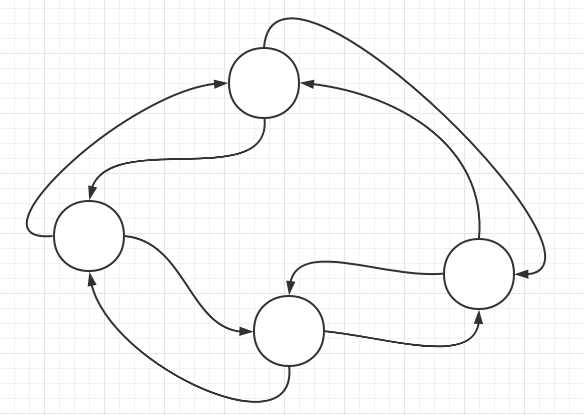
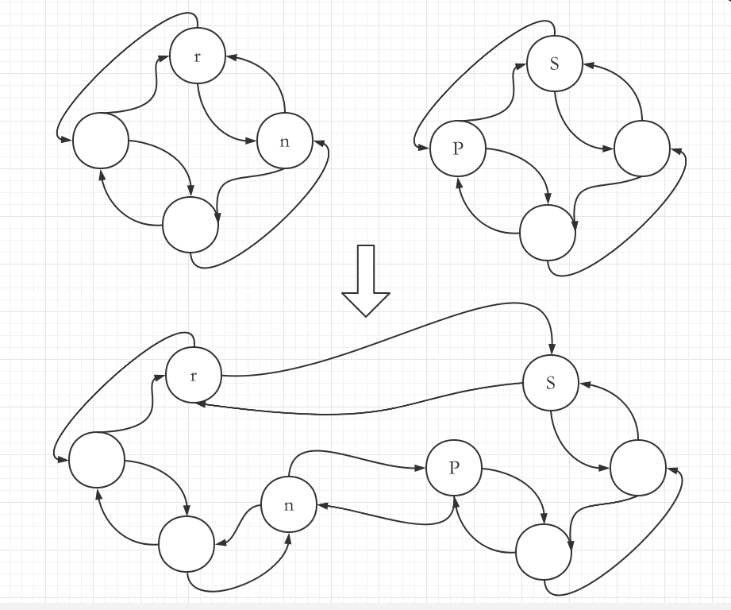
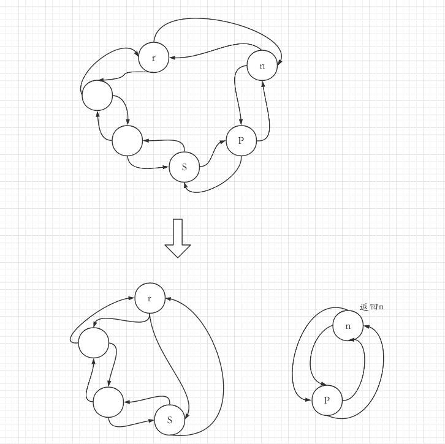
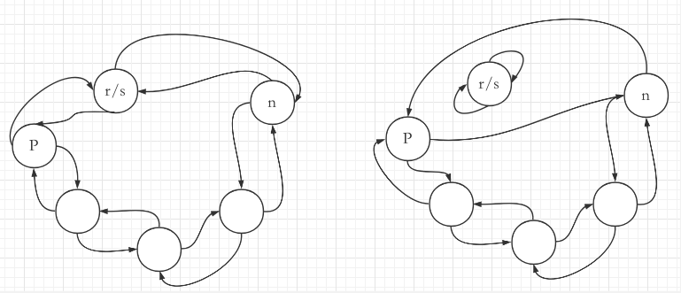

## 1.1 概述

该结构表示环，本质上和 list 一样，都是一个首尾相连的双向链表。不同之处在于:

- list 有逻辑上的首尾节点，而**ring 没有首尾节点**
- 支持的操作不同

下面是 Ring 结构的实现:

```Go
type Ring struct {
  next, prev *Ring
  Value      any // for use by client; untouched by this library
}
```

该结构的示意图如下:



## 1.2 方法

### 1.2.1 构造器 New 函数

下面是构造器的实现

需要传入一个整数 n，表示环的长度

```Go
func New(n int) *Ring {
  if n <= 0 {
    return nil
  }
  // 第一个节点，左右指针为nil
  r := new(Ring)
  p := r
  // 后续依次将剩下的节点添加到尾部
  for i := 1; i < n; i++ {
    p.next = &Ring{prev: p}
    p = p.next
  }
  // 闭环
  p.next = r
  r.prev = p
  return r
}
```

### 1.2.2 Prev 和 Next 方法

这两个方法用于获取环中当前节点左右两边的节点

```Go
// Next returns the next ring element. r must not be empty.
func (r *Ring) Next() *Ring {
  if r.next == nil {
    return r.init()
  }
  return r.next
}

// Prev returns the previous ring element. r must not be empty.
func (r *Ring) Prev() *Ring {
  if r.next == nil {
    return r.init()
  }
  return r.prev
}
```

### 1.2.3 Move 方法

此方法用于获取相对当前节点 n 个节点距离的节点。

可根据传入的参数控制方向，n 大于 0 表示向右，n 小于 0 表示向左

```Go
func (r *Ring) Move(n int) *Ring {
  if r.next == nil {
    return r.init()
  }
  switch {
  // n小于0向左移动
  case n < 0:
    for ; n < 0; n++ {
      r = r.prev
    }
  case n > 0:   // n > 0向右移动
    for ; n > 0; n-- {
      r = r.next
    }
  }
  return r
}
```

### 1.2.4 Len 方法

由于环中没有记录长度的字段，因此求环的长度需要从当前节点开始遍历，直到回到当前节点。效率较低。

下面是具体实现:

```Go
func (r *Ring) Len() int {
  n := 0
  if r != nil {
    n = 1
    // 从当前节点循环
    for p := r.Next(); p != r; p = p.next {
      n++
    }
  }
  return n
}
```

### 1.2.5 Link 和 Unlink 方法

#### (1) Link

Link 方法用于将两个环连接起来。

下面是具体实现:

```Go
func (r *Ring) Link(s *Ring) *Ring {
  n := r.Next()
  if s != nil {
    p := s.Prev()
    // Note: Cannot use multiple assignment because
    // evaluation order of LHS is not specified.
    r.next = s
    s.prev = r
    n.prev = p
    p.next = n
  }
  return n
}
```

而根据分析可以将连接过程分为三种情况:

- 情况一: r 和 s 不在一个环
- 情况二: r 和 s 在一个环，但是 r 和 s 不是同一个节点
- 情况三: r 和 s 指向同一个环的同一个节点

---

**情况一**

下面是示意图。

这种情况直接**将两个环连接成了一个环**



**情况二**

下面是示意图。

这种情况下会**把 r 和 s 之间的这部分节点从当前环中移除，并且形成一个单独的环，该方法返回新环的节点指针**。

如果 r 和 s 是相邻节点，那么不会有任何节点被移除



**情况三**

下面是示意图

r 和 s 指向同一个环的同一个节点，执行此方法后，**r 节点会单独成环**

示意图如下:



#### (2) Unlink

此方法的作用是将当前节点和当前节点后(或前)的第 n 个节点之间的节点移除

具体实现依赖于 Move 方法和 Link 方法。首先通过 Move 方法找到第 n 个节点，由于两个节点在一个环上，因此 Link 方法会将这之间的节点移除

```Go
func (r *Ring) Unlink(n int) *Ring {
  if n <= 0 {
    return nil
  }
  return r.Link(r.Move(n + 1))
}
```

### 1.2.6 Do 方法

此方法调用的时候需要传入一个函数作为参数，Do 方法内部会在环的每个节点上调用此函数。

```Go
func (r *Ring) Do(f func(any)) {
  if r != nil {
    f(r.Value)
    for p := r.Next(); p != r; p = p.next {
      f(p.Value)
    }
  }
}
```
