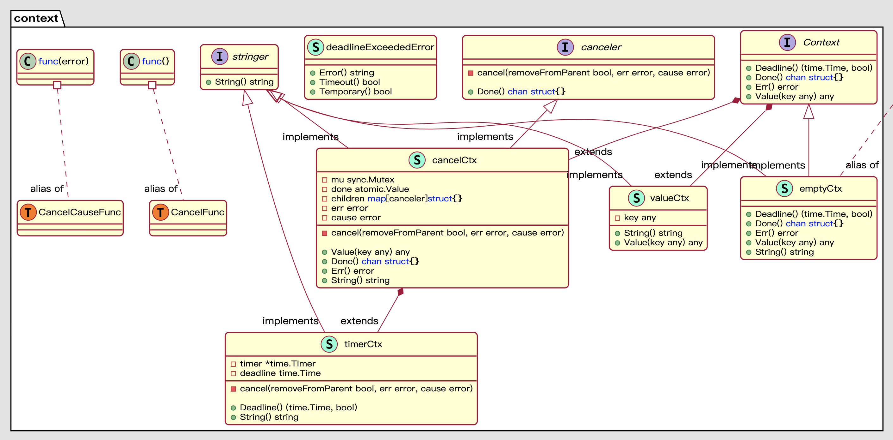

# 从源码探究golang中context的奥秘

## 1. 概览

使用过golang的小伙伴对context这个包一定不陌生，基本上我们开发中的大多数函数，都会看到context的身影，那么它到底有什么魔力，能够让我们对它如此情有独钟，下面就来看看context包的奥秘。

本文的golang版本为: 1.16

要对一个包进行源码分析，必不可少的要知道它都有哪些东西，比如哪些接口、结构、函数等，下面是context包的类图:



除了上述图中的接口和结构体之外，从源码中还能看到几个WithXXX形式的函数，下面就从源码角度一步步分析context的原理。

## 2. 接口

### 2.1 Context

先来看看定义:

Context接口定义了四个方法，这几个方法都是幂等的，即使是多次调用同一个方法，返回的信息都不变。

* Deadline: 返回此context的截止时间，可以基于此时间来决定后续操作。如果没有设置过deadline，则第二个参数返回false
* Done: 返回一个channel，通过此channel可以传递context被取消的信息。这其实是通过channel的机制实现:
  * 如果一个channel没有被关闭，那么在其他协程向该channel写入值之前，对此channel的读取都会阻塞
  * 读取已关闭的channel时会读到默认值，不会阻塞
  * Done函数返回的channel时**只读的**
  * 综上，除非Done返回的channel被关闭，否则对该channel的读取会一直阻塞。

* Err: 返回context被取消的原因。比如context被取消时会返回Canceled，超时时返回DeadlineExceeded；如果还未取消，则返回nil。
* Value: 基于key获取context中保存的值

```golang 
type Context interface {
	Deadline() (deadline time.Time, ok bool)
	Done() <-chan struct{}
	Err() error
	Value(key interface{}) interface{}
}
```

> 从接口及其字段的定义方式上可看出，如果我们想实现的自己的Context，只需要实现这个导出的接口即可。

### 2.2 canceler接口

context包中提供的另一个接口是canceller接口，只要实现了该接口，就表明该context是可以取消的。

从注释中可以知道，``*cancelCtx`和` *timerCtx`是这个接口的两个实现。

而需要注意的是，这个接口是**非导出的**，所以除了这个包提供的实现，没有办法在其它包里面实现这个接口。

```golang
type canceler interface {
	cancel(removeFromParent bool, err error)
	Done() <-chan struct{}
}
```

## 3. 结构体

### 3.1 emptyCtx

emptyCtx是context包中对Context接口的默认实现。

```golang 
type emptyCtx int

func (*emptyCtx) Deadline() (deadline time.Time, ok bool) {
	return
}

func (*emptyCtx) Done() <-chan struct{} {
	return nil
}

func (*emptyCtx) Err() error {
	return nil
}

func (*emptyCtx) Value(key interface{}) interface{} {
	return nil
}
```

正如名称所示，这个结构是一个空实现，没有deadline、无法取消、也不会携带值。但是这么简单的一个结构，在golang中却非常重要。

context包中默认申明了两个emptyCtx类型的变量，分别是background和todo，并提供了两个导出函数用于访问这两个变量

```golang 
var (
	background = new(emptyCtx)
	todo       = new(emptyCtx)
)
func TODO() Context {
	return todo
}
func Background() Context {
	return background
}
```

看到这里就非常清楚了，我们在给申明了Context参数的函数传参时，经常会传一个``context.Background()`，其实就是调用的这里的函数传递background变量。

这两个函数本质上并没有什么区别，不过就是返回同一个结构的两个不同变量而已，我们可以从语义上对它进行区分: Background()用于首次传递context，而TODO()则用于程序中占位，先用`context.TODO()`占位，以后再用其他的Context来替换。

### 3.2 cancelCtx

这是context包中提供的一个很重要的结构，从名称上就能知道，这是一个可以取消的Context。

从类图可知，这个结构实现了`Context`接口和`conceller`接口

```golang
type cancelCtx struct {
	Context

	mu       sync.Mutex            // protects following fields
	done     chan struct{}         // created lazily, closed by first cancel call
	children map[canceler]struct{} // set to nil by the first cancel call
	err      error                 // set to non-nil by the first cancel call
}
```

下面分析一下几个重要的方法:

首先是`Done`方法，该方法的主要作用就是获取context中的只读channel。

对channel的初始化采用的是懒加载的方式，只有首次调用Done方法时， c.done才会被初始化。

```golang 
func (c *cancelCtx) Done() <-chan struct{} {
	c.mu.Lock()
	if c.done == nil {
		c.done = make(chan struct{})
	}
	d := c.done
	c.mu.Unlock()
	return d
}
```

`Err`方法的实现比较简单，就是将concelCtx结构中的err变量读出来。

下面重点看一下`cancel`方法的实现，主要包含以后步骤:

* 校验err，必须设置取消的原因
* 判断是否已经被其它协程取消过(被取消过c.err必然不为nil)
* 设置err，关闭channel(此时如果有协程阻塞在channel的读操作上，会停止阻塞，继续执行，因此起到了通知作用)
* 遍历调用子context的cancel方法，取消所有的子context
* 将当前context从其父context的子context列表中移除

```golang 
func (c *cancelCtx) cancel(removeFromParent bool, err error) {
     // 传递err表示取消的原因
	if err == nil {
		panic("context: internal error: missing cancel error")
	}
	c.mu.Lock()
     // c.err != nil说明已经被其他的协程cancel过了
	if c.err != nil {
		c.mu.Unlock()
		return // already canceled
	}
     // 设置err
	c.err = err
     // 关闭channel
	if c.done == nil {
		c.done = closedchan
	} else {
		close(c.done)
	}
     // 遍历每一个子context，并调用子context的cancel方法
	for child := range c.children {
		// NOTE: acquiring the child's lock while holding parent's lock.
		child.cancel(false, err)
	}
     // 清空所有的子context
	c.children = nil
	c.mu.Unlock()
	// 将父context的引用从所有的子context中断开
	if removeFromParent {
		removeChild(c.Context, c)
	}
}
```

那么怎么创建一个可以取消的context呢，context包中提供了一个导出函数`WithCancel`，通过调用该函数并传入一个父Context(通常是context.Background())，就能够创建一个cancelCtx对象，并返回对应的取消函数。

```golang
func WithCancel(parent Context) (ctx Context, cancel CancelFunc) {
	if parent == nil {
		panic("cannot create context from nil parent")
	}
	c := newCancelCtx(parent)
	propagateCancel(parent, &c)
	return &c, func() { c.cancel(true, Canceled) }
}

// newCancelCtx returns an initialized cancelCtx.
func newCancelCtx(parent Context) cancelCtx {
	return cancelCtx{Context: parent}
}
```

注意到这里调用cancel方法时传入了一个`true`，从前面cancel方法的定义可知，这个参数(removeFromParent)用于控制是否将当前context从父context移除掉。什么意思呢，看下`removeChild`的定义就知道了。其实就是获取到当前节点的父节点，然后将当前节点从父节点的children这个map里面移除。

```golang
func removeChild(parent Context, child canceler) {
	p, ok := parentCancelCtx(parent)
	if !ok {
		return
	}
	p.mu.Lock()
	if p.children != nil {
		delete(p.children, child)
	}
	p.mu.Unlock()
}
```

`cancel`函数中有两处分别传递了true和false，为什么呢?

* 第一处是循环调用子context的cancel方法时，对于子context来说，没必要一个个将自己从父节点移除，因为循环结束后会统一将父节点的children清空；
* 第二处是调用WithCancel返回的取消函数时，虽然当前节点cancel了，但是当前节点的父节点并不知道，因此需要将当前节点从父节点的children结构中移除；

上面分析中跳过了一个很重要的函数，即`propagateCancel`，这个方法的主要作用就是将当前context挂靠到父节点。形象点说，就是让父节点知道有这么个子节点。

```golang 
func propagateCancel(parent Context, child canceler) {
     // 父节点为空
	done := parent.Done()
	if done == nil {
		return // parent is never canceled
	}

	select {
	case <-done:
		// parent is already canceled
		child.cancel(false, parent.Err())
		return
	default:
	}
  
     //  找到可以取消的父context
	if p, ok := parentCancelCtx(parent); ok {
		p.mu.Lock()
		if p.err != nil {
			// parent has already been canceled
              // 父节点已经取消了，那么当前节点也要取消
			child.cancel(false, p.err)
		} else {
               // 父节点未取消，先初始化父节点的children结构
			if p.children == nil {
				p.children = make(map[canceler]struct{})
			}
              // 将当前context挂靠到父节点
			p.children[child] = struct{}{}
		}
		p.mu.Unlock()
	} else {
    	 // 执行到这里说明当前节点节点没有可取消的父context，那么就需要一个单独的协程去监听父context的取消信号
		atomic.AddInt32(&goroutines, +1)
		go func() {
			select {
			case <-parent.Done():
				child.cancel(false, parent.Err())
			case <-child.Done():
			}
		}()
	}
}
```

上面方法实现上有个有意思的地方，即else分支。走到else分支时，说明当前context没有可以取消的父context，那么为什么还要有`<-parent.Done()`和`<-child.Done()`这两个case呢，一个永远不会执行，一个啥操作都没有，能不能去掉呢? 关键得看`parentCancelCtx`做了啥。

```golang 
func parentCancelCtx(parent Context) (*cancelCtx, bool) {
	done := parent.Done()
	if done == closedchan || done == nil {
		return nil, false
	}
	p, ok := parent.Value(&cancelCtxKey).(*cancelCtx)
	if !ok {
		return nil, false
	}
	p.mu.Lock()
	ok = p.done == done
	p.mu.Unlock()
	if !ok {
		return nil, false
	}
	return p, true
}
```

如果`p, ok := parent.Value(&cancelCtxKey).(*cancelCtx)`断言返回false，那么就走else分支。什么时候返回false?

比如自己实现一个自定义Context结构，然后将cancelCtx作为一个匿名字段，这种自定义Context结构的断言就是false。如下:

```golang 
type Ctx struct {
	Context
}

func main() {
	ctx, _ := WithCancel(background)
	ctx1 := Ctx{ctx}
	_ = isCancelCtx(ctx)
	_ = isCancelCtx(ctx1)
}

func isCancelCtx(ctx interface{}) bool {
	_, ok := ctx.(*cancelCtx)
	if !ok {
		fmt.Println("ctx is not a cancel context")
	} else {
		fmt.Println("ctx is a cancel context")
	}
	return ok
}

// ctx is a cancel context
// ctx is not a cancel context
```

这下就清楚了，如果我们在项目中通过组合这种匿名字段的方式定义Context，会走到else分支，另起一个协程来监听父context的取消事件，而第二个看似无用的case，则是在子context自己cancel时能够退出这个监听协程(否则如果父context一直不cancel，这个协程就会泄露)。

### 3.3 timerCtx

从类图可知，timeCtx是基于cancelCtx实现的，所以也具备cancel的能力。

```golang 
type timerCtx struct {
	cancelCtx
	timer *time.Timer // Under cancelCtx.mu.

	deadline time.Time
}
```

首先看看cancel方法。该方法的主要步骤是:

* 调用内部cancelCtx的cancel方法，够循环地取消该context下所有的子context
* 从父context中移除当前context
* 关闭定时器，防止deadline时重复关闭

```golang
func (c *timerCtx) cancel(removeFromParent bool, err error) {
	c.cancelCtx.cancel(false, err)
	if removeFromParent {
		// Remove this timerCtx from its parent cancelCtx's children.
		removeChild(c.cancelCtx.Context, c)
	}
	c.mu.Lock()
	if c.timer != nil {
		c.timer.Stop()
		c.timer = nil
	}
	c.mu.Unlock()
}
```

这样一个Context怎么使用呢?

其实和cancelCtx类似，context包提供了`WithTimeout`函数帮助我们快速创建。其调用`WithDeadline`函数，根据当前时间和传入的超时时间间隔计算出一个绝对时间作为`WithDeadline`的参数。主要步骤如下:

* 判断当前context的deadline是否早于父context的的deadline，如果是，直接创建cancelCtx。因为这种情况下，父context超时时会调用cancel方法，子context等不到超时就会被cancel；
* 创建timerCtx，并挂到父context的children结构中；
* 判断当前是否已经过了超时时间，是则直接调用cancel方法；
* 设置定时器，注册回调函数，定时器经过指定间隔后会调用cancel方法；

```golang 
func WithTimeout(parent Context, timeout time.Duration) (Context, CancelFunc) {
	return WithDeadline(parent, time.Now().Add(timeout))
}

func WithDeadline(parent Context, d time.Time) (Context, CancelFunc) {
	if parent == nil {
		panic("cannot create context from nil parent")
	}
    // 如果父context设置了deadline且早于当前context的deadline
    // 直接构造一个cancelCtx
	if cur, ok := parent.Deadline(); ok && cur.Before(d) {
		// The current deadline is already sooner than the new one.
		return WithCancel(parent)
	}
	c := &timerCtx{
		cancelCtx: newCancelCtx(parent),
		deadline:  d,
	}
     // 将当前context挂靠到指定的父context
	propagateCancel(parent, c)
     // 如果当前时间已经超时了，直接取消
	dur := time.Until(d)
	if dur <= 0 {
		c.cancel(true, DeadlineExceeded) // deadline has already passed
		return c, func() { c.cancel(false, Canceled) }
	}
	c.mu.Lock()
	defer c.mu.Unlock()
     // 设置一个定时操作，超时时调用cancel方法
	if c.err == nil {
		c.timer = time.AfterFunc(dur, func() {
			c.cancel(true, DeadlineExceeded)
		})
	}
	return c, func() { c.cancel(true, Canceled) }
}
```

综上我们知道，一个timerCtx有两种途径被cancel，一是在父context取消时被循环地取消，二是定时器经过指定时间主动调用cancel方法取消。

### 3.4 valueCtx

首先看定义，valueCtx内嵌了Context接口，因此也属于Context。

```golang 
type valueCtx struct {
	Context
	key, val interface{}
}
```

valueCtx包含两个interface{}类型的字段key和value，通过这两个变量，我们可以存储任意类型的值在Context中，并进行传递。

而实际上能真的存储任意类型吗？

在保存值的时候会对类型进行检查。和上面两种context类型，golang标准库提供了`WithValue`方法创建这种valueCtx，在该方法中对一些必要因素进行检查，如:

* 是否指定了非nil的context作为父context
* 是否指定了非nil的key
* key是否可比较

经过了以上校验，才会最终将key和value保存到这个context的字段里。

```golang 
func WithValue(parent Context, key, val interface{}) Context {
	if parent == nil {
		panic("cannot create context from nil parent")
	}
	if key == nil {
		panic("nil key")
	}
	if !reflectlite.TypeOf(key).Comparable() {
		panic("key is not comparable")
	}
	return &valueCtx{parent, key, val}
}
```

通过`WithValue`方法创建的context，会形成一个树形结构(和数据结构里面的树方向相反，由子节点指向父节点)，每个context作为一个节点，保存一对key和value。

设置了值之后怎么取值呢？context包提供了Value方法。这个方法取value的过程非常简单粗暴，就是递归地往父节点方向查找，直到找到第一个key相等的节点。

这种特性就导致了一种问题: 通过WithValue创建的context在极端情况下会形成一个链表，取值的过程就是一个查找链表的过程，效率可能会比较低。

```golang 
func (c *cancelCtx) Value(key interface{}) interface{} {
	if key == &cancelCtxKey {
		return c
	}
	return c.Context.Value(key)
}
```

## 4. 使用场景

上面讲了这个多原理性的东西，那这个context有什么用呢?

### 4.1 传递数据

比如想实现一个链路追踪，尤其是在微服务架构中，我们希望同一个请求的整个调用链路能够用一个唯一的ID(即traceid)关联起来，以便后期排查问题。

那这种情况就可以将这个ID通过context在各个函数调用之间传递，而不需要显式地将id作为一个参数(这样也容易忘记)。

还可以自定义一个日志库，该库从context中取出traceid，这样打印出来的日志就携带了traceid字段。

### 4.2 传递信号

这种在服务器代码中比较常见，主协程A初始化完毕后，一般会另起一个协程B，在该协程B开启一个死循环，循环内部接收客户端的请求。

在这种场景下，如果服务器需要进行关闭，那就要告诉负责协程B不再接收客户端请求，此时就可以使用context来实现。

主协程Close掉context，子协程走到`<-context.Done()`分支，执行return操作退出。

### 4.3 超时控制

比如我们有一个http请求，这个请求可能会由于各种因素导致等待时间较长，如果我们不希望系统一直等待，那么就可以结合select-case和context实现超时控制。

一旦到达我们预期的超时时间，请求还没有响应的话，context就会超时并取消，停止阻塞当前协程。

## 5. 注意事项

context源码包中给出了一些使用上的建议:

* Do not store Contexts inside a struct type; instead, pass a Context explicitly to each function that needs it. The Context should be the first parameter, typically named ctx

* Do not pass a nil Context, even if a function permits it. Pass context.TODO if you are unsure about which Context to use.
* Use context Values only for request-scoped data that transits processes and APIs, not for passing optional parameters to functions
* The same Context may be passed to functions running in different goroutines; Contexts are safe for simultaneous use by multiple goroutines.

说人话就是:

* 不要在结构体中存储context，而应该在所有需要context的函数中显式地传递context(并作为第一个参数，命名为ctx)
* 即使函数没有使用到context，也不要传递nil，如果不知道传哪种context，那就传context.TODO()
* ValueCtx应当用于传递请求范围的数据(在过程和API之间流转的)，而不应用于传递可选参数
* context是并发安全的

值得注意的是，虽然context是并发安全的，但是如果context内存放的数据不是并发安全的，依然会有并发问题，这应该由数据自身保证。


