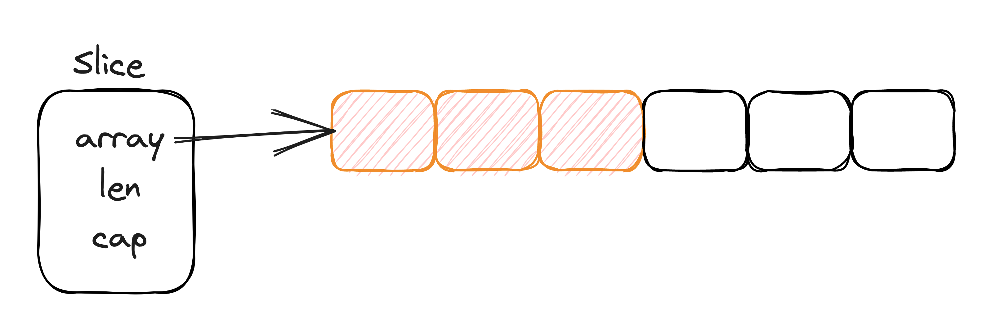

## 1.序言

写golang的同学，对切片(slice)一定不会陌生。可以说，切片是golang开发中使用最多的数据结构之一，需要的时候make一下，简直不要太简单。

然而要用好它，不熟悉原理怎么行。今天这篇文章，就来看看golang中是怎么处理切片相关操作的。

golang版本: `go version go1.19.4 linux/amd64`

## 2.问题引入

在深入分析切片原理之前，先来看看下述代码片段会输出什么结果，相信通过这几段代码，能够帮助我们更加深入地了解切片的使用技巧和原理:

### 2.1 代码1

通过几种不同的方式声明切片，区别是什么

```golang
func main() {
	var s1 []int
	s2 := make([]int, 0, 10)
	s3 := make([]int, 10)
	s4 := []int{1, 2, 3, 4, 5, 6, 7, 8, 9}
	fmt.Println(s1, s2, s3, s4)
}
```

### 2.2 代码2

执行以下操作:

* 初始化长度为0，容量为10的切片s
* 对s执行一次append操作
* 初始化长度为10，容量为10的切片s1
* 对s1执行一次append操作

执行完后s/s1的长度和容量分别是多少

```golang
func main() {
	s := make([]int, 0, 10)
	s = append(s, 1)
	fmt.Printf("len: %d, cap: %d\n", len(s), cap(s))

	s1 := make([]int, 10, 10)
	s1 = append(s1, 1)
	fmt.Printf("len: %d, cap: %d\n", len(s1), cap(s1))
}
```

### 2.3 代码3

执行以下操作:

* 初始化长度为8，容量为10的切片s
* 将切片s中索引为6以后的元素截断赋值给s1
* 将切片s中索引[6,7]之间的元素截断赋值给s2
* 将切片s中索引为6以前的元素截断赋值给s3


执行完后s1/s2/s3的长度和容量分别是多少

```golang
func main() {
	s := make([]int, 8, 10)
	s1 := s[6:]
  s2 := s[6:7]
  s3 := s[:6]
	fmt.Printf("len: %d, cap: %d\n", len(s1), cap(s1))
	fmt.Printf("len: %d, cap: %d\n", len(s2), cap(s2))
	fmt.Printf("len: %d, cap: %d\n", len(s3), cap(s3))
}
```

### 2.4 代码4

执行以下操作:

* 初始化长度为8，容量为10的切片s
* 将切片s中索引为4以后的元素截断赋值给s1
* 修改s1[0]的值
* 将切片s中索引为6以后的元素截断赋值给s2
* 将s2传给函数change，在change中修改索引0处的值


执行完后s是否会受影响

```golang
func main() {
	s := make([]int, 8, 10)
	s1 := s[4:]
	s1[0] = 100
	fmt.Println(s)

	s2 := s[6:]
	change(s2)
	fmt.Println(s)
}

func change(s2 []int) {
	s2[0] = 200
}
```

### 2.5 代码5

执行以下操作:

* 初始化长度为8，容量为10的切片s
* 将切片s中索引为6以后的元素截断赋值给s1
* 向s1中append5个元素
* 将切片s中索引为6以后的元素截断赋值给s2
* 将s2传给函数change，在change中向s2中append5个元素


执行完后s是否会受影响

```golang
func main() {
	s := make([]int, 8, 10)
	s1 := s[6:]
	s1 = append(s1, []int{1, 2, 3, 4, 5}...)
	fmt.Printf("len: %d, cap: %d\n", len(s), cap(s))

	s2 := s[6:]
	change(s2)
	fmt.Printf("len: %d, cap: %d\n", len(s), cap(s))
}

func change(s2 []int) {
	s2 = append(s2, []int{1, 2, 3, 4, 5}...)
}
```

### 2.6 代码6

执行以下操作:

* 初始化长度为512，容量为512的切片s
* 向其中append一个元素

执行完后s的长度和容量分别是多少

```golang
func main() {
	s := make([]int, 512)
	s = append(s, 1)
	fmt.Printf("len: %d, cap: %d\n", len(s), cap(s))
}
```

### 2.7 代码7

执行以下操作:

* 初始化切片s，元素为{1,2,3,4,5}
* 删除元素3

执行完后s的长度和容量分别是多少

```golang
func main() {
	s := []int{1, 2, 3, 4, 5}
	s = append(s[:2], s[3:]...)
	fmt.Printf("len: %d, cap: %d\n", len(s), cap(s))
}
```

## 3.数据结构

切片对应的数据结构定义位于`runtime/slice.go`文件中，其定义如下:

```golang
type slice struct {
	array unsafe.Pointer
	len   int
	cap   int
}
```

切片本质上是个结构体，包含三个字段:

* array: 指向底层数据结构的指针，由于在声明切片时要指定类型，因此可认为这里是一个指向数组起始位置的指针
* len: 切片的长度，即切片当前已容纳的元素个数，只能通过索引访问[0,len - 1]之间的元素，否则会越界
* cap: 切片的容量，即切片一共能容纳的元素个数



我们在进行切片赋值、传参、截断时，其实是复制了一个slice结构体，只不过底层的数组是同一个。这就导致无论是在复制的切片中修改值，还是在修改形参切片的值，都会印象到原来的切片。

## 4.创建切片

代码1中提及了几种声明和初始化方式，下面结合slice结构体的定义及对应代码的部分汇编代码片段来看看。

需要注意的是，为了展示起来方便，这里在分析第一种声明方法时注释掉了其他方法。

> 可以通过`go tool compile -S -N -l main.go > main.s`将汇编代码输出到main.s文件中。其中`-S`表示生成汇编代码，`-N`表示禁用优化，`-l`表示禁用内联

下面是`var s1 []int`生成的汇编:

```golang
// 将X15寄存器的值移动到+56位置，其实就是切片s1的起始位置，大小为16个字节，所以下一条指令从+72开始
// type slice struct {
// 	array unsafe.Pointer
// 	len   int
// 	cap   int
// }
// 结合slice的结构可知，这里其实写了array和len部分。
0x0018 00024 (main.go:6)	MOVUPS	X15, main.s1+56(SP)
// 这里将cap设置为0
0x001e 00030 (main.go:6)	MOVQ	$0, main.s1+72(SP)
```

X15寄存器在前面没有进行设置，默认情况下值为0，这里应该是将底层数组的地址和len设置为0。

从这里可知，**这种方式声明的切片并没有真实的为底层数组分配空间**，这也就是所说的nil切片。

我们经常混淆的另一个概念是空切片，空切片指的是容量为0的切片，比如`var s = []int{}`，来看看它生成的汇编代码:

```golang
// runtime.zerobase 是某一段固定内存
0x0018 00024 (main.go:14)	LEAQ	runtime.zerobase(SB), DX
0x001f 00031 (main.go:14)	MOVQ	DX, main..autotmp_2+40(SP)
0x0024 00036 (main.go:14)	TESTB	AL, (DX)
0x0026 00038 (main.go:14)	JMP	40
// 将该固定内存地址作为底层数组的地址
0x0028 00040 (main.go:14)	MOVQ	DX, main.s5+64(SP)
0x002d 00045 (main.go:14)	MOVUPS	X15, main.s5+72(SP)
0x0033 00051 (main.go:15)	MOVUPS	X15, main..autotmp_1+48(SP)
```

因此可以得出结论: 

* nil切片仅进行声明，没有初始化，因此底层数组地址为0
* 空切片完整地进行了初始化，容量为0，底层数组指向一段特定的内存区域

下面是`s2 := make([]int, 0, 10)`生成的汇编:

这里要比上面的方式清晰的多，切片中每个字段都进行了单独设置。

```golang
// 调用runtime.makeslice为底层数组分配内存
0x0026 00038 (main.go:8)	CALL	runtime.makeslice(SB)
// 初始化底层数组，这里保存了地址，大小为8字节
0x002b 00043 (main.go:8)	MOVQ	AX, main.s2+56(SP)
// len设置为0，大小为8字节
0x0030 00048 (main.go:8)	MOVQ	$0, main.s2+64(SP)
// cap设置为10，大小为8字节
0x0039 00057 (main.go:8)	MOVQ	$10, main.s2+72(SP)
```

接下来是`s3 := make([]int, 10)`，和上一种方式类似，不同之处在于这里会将len设置为10

```golang
0x0027 00039 (main.go:10)	CALL	runtime.makeslice(SB)
0x002c 00044 (main.go:10)	MOVQ	AX, main.s3+56(SP)
0x0031 00049 (main.go:10)	MOVQ	$10, main.s3+64(SP)
0x003a 00058 (main.go:10)	MOVQ	$10, main.s3+72(SP)
```

最后`s4 := []int{1, 2, 3, 4, 5, 6, 7, 8, 9}`这种在声明时初始化的方式，与上面几种方式都不同。

在编译时就已经初始化好了一段连续的内存，并且将值保存到了对应位置。在声明切片时直接将这段内存起始地址保存到切片的array字段中。

```golang
0x0025 00037 (main.go:12)	MOVQ	AX, main..autotmp_2+40(SP)
0x002a 00042 (main.go:12)	MOVQ	$1, (AX)
0x0031 00049 (main.go:12)	MOVQ	main..autotmp_2+40(SP), CX
0x0036 00054 (main.go:12)	TESTB	AL, (CX)
0x0038 00056 (main.go:12)	MOVQ	$2, 8(CX)
0x0040 00064 (main.go:12)	MOVQ	main..autotmp_2+40(SP), CX
0x0045 00069 (main.go:12)	TESTB	AL, (CX)
0x0047 00071 (main.go:12)	MOVQ	$3, 16(CX)
0x004f 00079 (main.go:12)	MOVQ	main..autotmp_2+40(SP), CX
0x0054 00084 (main.go:12)	TESTB	AL, (CX)
0x0056 00086 (main.go:12)	MOVQ	$4, 24(CX)
0x005e 00094 (main.go:12)	MOVQ	main..autotmp_2+40(SP), CX
0x0063 00099 (main.go:12)	TESTB	AL, (CX)
0x0065 00101 (main.go:12)	MOVQ	$5, 32(CX)
0x006d 00109 (main.go:12)	MOVQ	main..autotmp_2+40(SP), CX
0x0072 00114 (main.go:12)	TESTB	AL, (CX)
0x0074 00116 (main.go:12)	MOVQ	$6, 40(CX)
0x007c 00124 (main.go:12)	MOVQ	main..autotmp_2+40(SP), CX
0x0081 00129 (main.go:12)	TESTB	AL, (CX)
0x0083 00131 (main.go:12)	MOVQ	$7, 48(CX)
0x008b 00139 (main.go:12)	MOVQ	main..autotmp_2+40(SP), CX
0x0090 00144 (main.go:12)	TESTB	AL, (CX)
0x0092 00146 (main.go:12)	MOVQ	$8, 56(CX)
0x009a 00154 (main.go:12)	MOVQ	main..autotmp_2+40(SP), CX
0x009f 00159 (main.go:12)	TESTB	AL, (CX)
0x00a1 00161 (main.go:12)	MOVQ	$9, 64(CX)
0x00a9 00169 (main.go:12)	MOVQ	main..autotmp_2+40(SP), CX
0x00ae 00174 (main.go:12)	TESTB	AL, (CX)
0x00b0 00176 (main.go:12)	JMP	178
0x00b2 00178 (main.go:12)	MOVQ	CX, main.s4+64(SP)
0x00b7 00183 (main.go:12)	MOVQ	$9, main.s4+72(SP)
0x00c0 00192 (main.go:12)	MOVQ	$9, main.s4+80(SP)
```

上述分析中涉及到两个golang标准库的代码:

* `runtime.zerobase`
* `runtime.makeslice`

### 4.1 runtime.zerobase

可以认为是一段运行时预分配好内存空间，不仅这里用到了，在空结构体中也有用到。具体参考: [https://blog.csdn.net/slphahaha/article/details/121134367](https://blog.csdn.net/slphahaha/article/details/121134367)

### 4.2 runtime.makeslice

这一段逻辑并不复杂，主要流程为:

* 计算`cap * size`，也就是需要分配的内存空间大小
* 必要的校验: 是否溢出、内存需求是否大于最大可分配内存以及对长度和容量的校验
* 如果上述校验失败，则尝试基于len计算待分配内存大小，并进行校验
* 校验通过则调用`mallocgc`分配内存

有关内存分配的细节这里不予讨论，以后会专门进行分析。

```golang
func makeslice(et *_type, len, cap int) unsafe.Pointer {
	mem, overflow := math.MulUintptr(et.size, uintptr(cap))
	if overflow || mem > maxAlloc || len < 0 || len > cap {
		mem, overflow := math.MulUintptr(et.size, uintptr(len))
		if overflow || mem > maxAlloc || len < 0 {
			panicmakeslicelen()
		}
		panicmakeslicecap()
	}

	return mallocgc(mem, et, true)
}
```

## 5.切片截取

通常用形如s[a:b]的格式进行切片截取，其中a,b为截取的索引，不包含索引b位置的元素。a和b是可以缺省的，缺省情况下a默认为0，b默认为len - 1。

下面来看看这段代码对应的汇编实现，源代码如下:

```golang
s := make([]int, 8, 10)
s1 := s[6:]
```
对应的汇编是:

```golang
// 为切片s底层数组分配内存
0x0037 00055 (main.go:6)	CALL	runtime.makeslice(SB)
// 创建切片s，AX寄存器保存了底层数组的地址
0x003c 00060 (main.go:6)	MOVQ	AX, main.s+128(SP)
0x0044 00068 (main.go:6)	MOVQ	$8, main.s+136(SP)
0x0050 00080 (main.go:6)	MOVQ	$10, main.s+144(SP)
0x005c 00092 (main.go:7)	JMP	94
0x005e 00094 (main.go:7)	PCDATA	$1, $-1
0x005e 00094 (main.go:7)	NOP
0x0060 00096 (main.go:7)	JMP	98
// 这里将AX中的地址加上偏移量48(刚好就是6个元素的大小)后，作为切片s2的底层数组地址
0x0062 00098 (main.go:7)	LEAQ	48(AX), DX
0x0066 00102 (main.go:7)	MOVQ	DX, main.s1+104(SP)
0x006b 00107 (main.go:7)	MOVQ	$2, main.s1+112(SP)
0x0074 00116 (main.go:7)	MOVQ	$4, main.s1+120(SP)
```

不难看出，这种方式会创建一个新的slice结构，只不过底层数组还是共用的。所以截取后，修改s1的元素会影响到原始切片s。

## 6.切片赋值

和切片截断其实是一样的，都会分配一个新的slice结构，重新计算并设置len和cap，共用底层数组。

```golang
0x0037 00055 (main.go:6)	CALL	runtime.makeslice(SB)
0x003c 00060 (main.go:6)	MOVQ	AX, main.s+72(SP)
0x0041 00065 (main.go:6)	MOVQ	$8, main.s+80(SP)
0x004a 00074 (main.go:6)	MOVQ	$10, main.s+88(SP)
0x0053 00083 (main.go:10)	MOVQ	AX, main.s4+48(SP)
0x0058 00088 (main.go:10)	MOVQ	$8, main.s4+56(SP)
0x0061 00097 (main.go:10)	MOVQ	$10, main.s4+64(SP)
```

## 7.切片追加

golang提供append函数进行切片元素追加，其实包含两种情况:

* 情况一: 切片剩余容量大于追加元素个数，不会触发扩容
* 情况二: 切片剩余容量小于追加元素个数，会触发扩容

这里先讨论第一种，源代码如下:

```golang
s1 := make([]int, 0, 5)
s1 = append(s1, 1, 2)
```

该代码创建一个len = 0, cap等于5的切片并向其中追加两个元素。显然符合情况一。对应的汇编代码如下:

```golang
// 创建切片s1
0x0026 00038 (main.go:10)	CALL	runtime.makeslice(SB)
0x002b 00043 (main.go:10)	MOVQ	AX, main.s1+56(SP)
0x0030 00048 (main.go:10)	MOVQ	$0, main.s1+64(SP)
0x0039 00057 (main.go:10)	MOVQ	$5, main.s1+72(SP)
0x0042 00066 (main.go:11)	JMP	68
// 直接将值保存到底层数组对应的位置
0x0044 00068 (main.go:11)	MOVQ	$1, (AX)
0x004b 00075 (main.go:11)	MOVQ	$2, 8(AX)
0x0053 00083 (main.go:11)	MOVQ	AX, main.s1+56(SP)
// 修改len
0x0058 00088 (main.go:11)	MOVQ	$2, main.s1+64(SP)
0x0061 00097 (main.go:11)	MOVQ	$5, main.s1+72(SP)
```

从上面可知，情况一这种场景，会直接将值写到切片底层数组对应的位置，并不会开辟新的内存空间。

## 8.扩容

如果追加的元素个数大于切片剩余容量，会发生什么呢?

这里创建一个len = 4, cap等于5的切片并向其中追加两个元素，源代码如下:

```golang
s1 := make([]int, 4, 5)
s1 = append(s1, 1, 2)
```

对应的汇编代码是:

```golang
// 创建原始切片s1
0x0037 00055 (main.go:10)	CALL	runtime.makeslice(SB)
0x003c 00060 (main.go:10)	MOVQ	AX, main.s1+96(SP)
0x0041 00065 (main.go:10)	MOVQ	$4, main.s1+104(SP)
0x004a 00074 (main.go:10)	MOVQ	$5, main.s1+112(SP)
0x0053 00083 (main.go:11)	JMP	85
0x0055 00085 (main.go:11)	MOVQ	AX, BX
0x0058 00088 (main.go:11)	MOVL	$4, CX
0x005d 00093 (main.go:11)	MOVL	$5, DI
0x0062 00098 (main.go:11)	MOVL	$6, SI
// 切片扩容
0x0067 00103 (main.go:11)	LEAQ	type.int(SB), AX
0x006e 00110 (main.go:11)	CALL	runtime.growslice(SB)
0x0073 00115 (main.go:11)	LEAQ	2(BX), DX
0x0077 00119 (main.go:11)	JMP	121
// 将元素保存到扩容后的底层数组对应位置
0x0079 00121 (main.go:11)	MOVQ	$1, 32(AX)
0x0081 00129 (main.go:11)	MOVQ	$2, 40(AX)
0x0089 00137 (main.go:11)	MOVQ	AX, main.s1+96(SP)
0x008e 00142 (main.go:11)	MOVQ	DX, main.s1+104(SP)
0x0093 00147 (main.go:11)	MOVQ	CX, main.s1+112(SP)
```

这里唯一的区别就是: 会调用`runtime.growslice`方法进行元素扩容。

下面来详细分析下扩容原理是什么:

```golang
func growslice(et *_type, old slice, cap int) slice {
	...
	// 如果新容量比原容量还小，直接panic
	if cap < old.cap {
		panic(errorString("growslice: cap out of range"))
	}

	// 如果指定的容量为0，则直接用zerobase的地址作为底层数组的地址。其实就对应于使用这种: var s = []int{}
	if et.size == 0 {
		return slice{unsafe.Pointer(&zerobase), old.len, cap}
	}

	// 计算原容量的2倍
	newcap := old.cap
	doublecap := newcap + newcap
	// 如果新容量比原容量的两倍还大，则直接取新容量
	if cap > doublecap {
		newcap = cap
	} else {
		const threshold = 256
		// 原容量小于256，则取原容量的两倍
		if old.cap < threshold {
			newcap = doublecap
		} else {
			// 对原容量 * 1.25 并加上192
			// 循环执行上述操作，直到扩容后的容量已经大于等于预期的新容量为止
			for 0 < newcap && newcap < cap {
				newcap += (newcap + 3*threshold) / 4
			}
			// 溢出了，直接取指定的容量
			if newcap <= 0 {
				newcap = cap
			}
		}
	}

	var overflow bool
	var lenmem, newlenmem, capmem uintptr
	// 基于上面确定的容量，计算分配底层数组所需的内存大小capmem
	switch {
	// 数组元素大小为1，capmem取 newcap * 1，并基于size class向上取整
	case et.size == 1:
		lenmem = uintptr(old.len)
		newlenmem = uintptr(cap)
		capmem = roundupsize(uintptr(newcap))
		overflow = uintptr(newcap) > maxAlloc
		newcap = int(capmem)
	// 数组元素是指针类型，capmem取: 指针大小 * newcap，并基于size class向上取整
	case et.size == goarch.PtrSize:
		lenmem = uintptr(old.len) * goarch.PtrSize
		newlenmem = uintptr(cap) * goarch.PtrSize
		capmem = roundupsize(uintptr(newcap) * goarch.PtrSize)
		overflow = uintptr(newcap) > maxAlloc/goarch.PtrSize
		newcap = int(capmem / goarch.PtrSize)
  // 数组元素大小是2的幂，通过位运算计算capmem，并基于size class向上取整
	case isPowerOfTwo(et.size):
		var shift uintptr
		if goarch.PtrSize == 8 {
			// Mask shift for better code generation.
			shift = uintptr(sys.Ctz64(uint64(et.size))) & 63
		} else {
			shift = uintptr(sys.Ctz32(uint32(et.size))) & 31
		}
		lenmem = uintptr(old.len) << shift
		newlenmem = uintptr(cap) << shift
		capmem = roundupsize(uintptr(newcap) << shift)
		overflow = uintptr(newcap) > (maxAlloc >> shift)
		newcap = int(capmem >> shift)
	default:
	// 其他类型，capmem取: 元素大小 * newcap，并基于size class向上取整
		lenmem = uintptr(old.len) * et.size
		newlenmem = uintptr(cap) * et.size
		capmem, overflow = math.MulUintptr(et.size, uintptr(newcap))
		capmem = roundupsize(capmem)
		newcap = int(capmem / et.size)
	}

	if overflow || capmem > maxAlloc {
		panic(errorString("growslice: cap out of range"))
	}

  // 根据上面计算的capmem分配内存空间
	var p unsafe.Pointer
	if et.ptrdata == 0 {
		p = mallocgc(capmem, nil, false)
		// The append() that calls growslice is going to overwrite from old.len to cap (which will be the new length).
		// Only clear the part that will not be overwritten.
		memclrNoHeapPointers(add(p, newlenmem), capmem-newlenmem)
	} else {
		// Note: can't use rawmem (which avoids zeroing of memory), because then GC can scan uninitialized memory.
		p = mallocgc(capmem, et, true)
		if lenmem > 0 && writeBarrier.enabled {
			// Only shade the pointers in old.array since we know the destination slice p
			// only contains nil pointers because it has been cleared during alloc.
			bulkBarrierPreWriteSrcOnly(uintptr(p), uintptr(old.array), lenmem-et.size+et.ptrdata)
		}
	}
	// 将原切片中的元素复制到新开辟的内存中
	memmove(p, old.array, lenmem)

	// 创建一个新的切片
	return slice{p, old.len, newcap}
}
```

核心流程总结如下:
* 容量校验，确定预期容量大于原始容量
* 针对元素大小为0的情况进行优化，复用zerobase
* 初步计算待分配容量:
  * 预期容量超过原始容量2倍，直接取预期容量
  * 预期容量不超过原始容量2倍，根据原始容量判断: 小于256时，按原始容量的2倍扩容；超过256时，待分配容量 = 原始容量 * 1.25 + 192，这里有一个循环处理的过程以保证待分配容量大于预期容量
* 基于上述计算的待分配容量，结合golang中内存分配的size class，计算实际应该分配的内存大小
* 调用mallocgc分配内存
* 使用`memmove`将切片的底层数组元素移动到新开辟的内存空间，返回新的slice结构

## 9.拷贝

其实标题6中也是一个拷贝方式，这种方式会生成一个新的slice结构，底层数组和原始切片共用(未扩容前)。

另一种拷贝是通过`copy`函数实现的，如下:

```golang
func main() {
	s := []int{1, 2, 3}
	s1 := make([]int, 3, 3)
	copy(s1, s)
	fmt.Println(s1)
}
```

生成的汇编如下:

```golang
0x0062 00098 (main.go:6)	MOVQ	DX, main.s+128(SP)
0x006a 00106 (main.go:6)	MOVQ	$3, main.s+136(SP)
0x0076 00118 (main.go:6)	MOVQ	$3, main.s+144(SP)
0x0082 00130 (main.go:7)	LEAQ	type.int(SB), AX
0x0089 00137 (main.go:7)	MOVL	$3, BX
0x008e 00142 (main.go:7)	MOVQ	BX, CX
0x0091 00145 (main.go:7)	PCDATA	$1, $1
0x0091 00145 (main.go:7)	CALL	runtime.makeslice(SB)
0x0096 00150 (main.go:7)	MOVQ	AX, main.s1+104(SP)
0x009b 00155 (main.go:7)	MOVQ	$3, main.s1+112(SP)
0x00a4 00164 (main.go:7)	MOVQ	$3, main.s1+120(SP)
...
0x0159 00345 (main.go:8)	CALL	runtime.memmove(SB)
```

这里可以看到，通过copy函数进行切片复制时，调用了`runtime.memmove`将整块内存拷贝到目标区域。

这里其实隐藏了一个坑，如果声明s1时指定len为0，那么就达不到copy的效果，因为没有对len进行过修改，len还是0。

## 10.总结

通过上述对源代码和汇编代码的分析，对切片的理解更深刻了。

对于文章开头提出的几个问题，相信应该有了答案。本文中涉及到的源代码和汇编代码，我都放到了[这个仓库](https://github.com/amosir/golang_source)，有兴趣的可以自己跑一跑。

其实文中还遗留了一个问题，也就是size class是怎么确定的，这部分我将会在分析golang内存管理相关原理时进行详细的说明。


