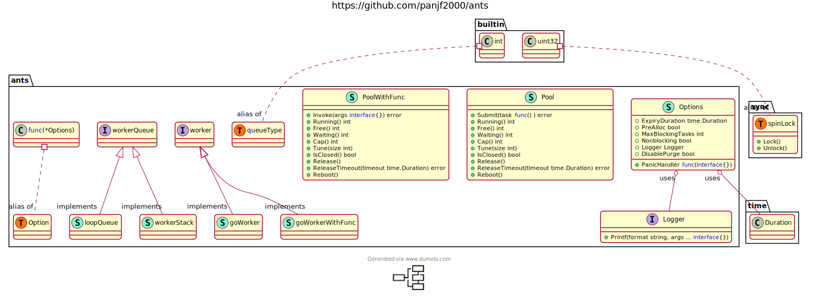

## 1. 简介

我们都知道，golang很适合用来开发高并发的服务端程序。很大一部分原因在于golang的协程机制，想使用并发时直接`go`一下即可。

比如`go func(){}()`

但即使使用起来很方便，如果毫无机制地用它创建协程，也可能会对内存带来极大的消耗。

我们希望，能够像使用内存池一样，能够及时地把跑完的协程放回去，使用时再拿出来。`ant`就是这样一款协程池的实现。

地址: [https://github.com/panjf2000/ants](https://github.com/panjf2000/ants)，截止到2023-05-30，该项目已经有10.3K star了， 值得一学。

下面是该库的类图结构:



## 2. 核心数据结构

### 2.1 协程池 Pool

协程池顾名思义，就是一个类似池子的结构，下面是其定义:

```golang
type Pool struct {
	capacity int32

	running int32

	lock sync.Locker

	workers workerQueue

	state int32

	cond *sync.Cond

	workerCache sync.Pool

	waiting int32

	purgeDone int32
	stopPurge context.CancelFunc

	ticktockDone int32
	stopTicktock context.CancelFunc

	now atomic.Value

	options *Options
}
```

下面是个主要字段的详细含义:

* capacity: 协程池容量
* running: 当前协程池中正在运行的协程数
* workers: 保存可用协程的结构
* state: 协程池状态
* cond: 协程池无可用协程时，阻塞协程。有空闲协程时，唤醒阻塞的协程
* waiting: 处于阻塞状态的协程数
* options: 可以对协程池进行一些配置

### 2.2 协程队列 workerQueue

这个是协程池内用于保存协程的实际结构，workerQueue实际是个接口

```golang
type workerQueue interface {
	len() int
	isEmpty() bool
	insert(worker) error
	detach() worker
	refresh(duration time.Duration) []worker // clean up the stale workers and return them
	reset()
}
```

ants库为其提供了两种实现，包括`loopQueue`和`workerStack`，这里我们只关注`loopQueue`的实现。

该实现其实是用数组实现的循环队列，用两个索引head和tail标记下一个应该读取和插入的位置。

初始时head == tail == 0，新增元素时tail + 1，如果刚好队列满了，此时head == tail，isFull为true；
删除元素时，head + 1，如果刚好删完了元素，head == tail。

```golang
type loopQueue struct {
	items  []worker
	expiry []worker
	head   int
	tail   int
	size   int
	isFull bool
}
```

队列最重要的操作就是插入和删除操作，在loopQueue中都实现了。

```golang
func (wq *loopQueue) insert(w worker) error {
  // 队列容量为0
	if wq.size == 0 {
		return errQueueIsReleased
	}

  // 队列满了
	if wq.isFull {
		return errQueueIsFull
	}
  
  // 队列未满，在队尾插入新元素，队尾索引后移
	wq.items[wq.tail] = w
	wq.tail++

  // 插入后队列满了，此时tail变为0
	if wq.tail == wq.size {
		wq.tail = 0
	}
	if wq.tail == wq.head {
		wq.isFull = true
	}

	return nil
}
```

```golang
func (wq *loopQueue) detach() worker {
  // 队列为空
	if wq.isEmpty() {
		return nil
	}

  // 从头部取出一个元素
	w := wq.items[wq.head]
	wq.items[wq.head] = nil
  // 头部索引后移
	wq.head++
	if wq.head == wq.size {
		wq.head = 0
	}
	wq.isFull = false

	return w
}
```

### 2.3 工作协程 worker

workerQueue是实际保存工作协程的接口，而工作协程这里也进行了抽象，即`worker`。

```golang
type worker interface {
	run()
	finish()
	lastUsedTime() time.Time
	inputFunc(func())
	inputParam(interface{})
}
```

同样也提供了两种实现，分别是`goWorker`和`goWorkerWithFunc`，一种为通用的协程池使用，一种为专用的协程池使用。

这里关注一下`goWorker`。其包括三个字段:

* pool: 所属协程池
* task: 该worker将要执行的任务
* lastUsed: 最近一次使用的时间，即最近一次放回协程池的时间

```golang
type goWorker struct {
	// pool who owns this worker.
	pool *Pool

	// task is a job should be done.
	task chan func()

	// lastUsed will be updated when putting a worker back into queue.
	lastUsed time.Time
}
```

worker中核心的逻辑是run，该函数会循环地从task channel中获取任务并执行，执行完后将自身放回到协程池中，然后唤醒阻塞在submit处的协程。

```golang
func (w *goWorker) run() {
	w.pool.addRunning(1)
	go func() {
		// 清理工作
		defer func() {
			w.pool.addRunning(-1)
			w.pool.workerCache.Put(w)
			...
			// 执行完后worker就空出来了，可以唤醒等待worker的协程
			w.pool.cond.Signal()
		}()

		// 循环从channel中获取任务()
		for f := range w.task {
			if f == nil {
				return
			}
			// 执行任务函数
			f()
			// 放回协程池
			if ok := w.pool.revertWorker(w); !ok {
				return
			}
		}
	}()
}
```

## 3. 操作

### 3.1 创建协程池

ants提供了`NewPool`帮助我们创建协程池。其主要流程如下:

* 判断协程池大小。如果传入的size为负数，则不限制协程的数量
* 自定义配置。包括清理时间、日志
* 创建协程池结构
* 初始化协程池缓存
* 初始化协程队列
* 初始化Cond
* 启用额外的协程进行辅助性操作

```golang
func NewPool(size int, options ...Option) (*Pool, error) {
	// 容量为负数，表示不限制协程数
	if size <= 0 {
		size = -1
	}

	// 自定义配置
	opts := loadOptions(options...)

	// DisablePurge被禁用了，此时多余的worker会被清理(清理周期就是opts.ExpiryDuration)
	if !opts.DisablePurge {
		if expiry := opts.ExpiryDuration; expiry < 0 {
			return nil, ErrInvalidPoolExpiry
		} else if expiry == 0 {
			opts.ExpiryDuration = DefaultCleanIntervalTime
		}
	}

	if opts.Logger == nil {
		opts.Logger = defaultLogger
	}

	p := &Pool{
		capacity: int32(size),
		lock:     syncx.NewSpinLock(), // 自旋锁
		options:  opts,
	}
	p.workerCache.New = func() interface{} {
		return &goWorker{
			pool: p,
			task: make(chan func(), workerChanCap),
		}
	}

	// 是否进行worker池预分配
	if p.options.PreAlloc {
		if size == -1 {
			return nil, ErrInvalidPreAllocSize
		}
		p.workers = newWorkerArray(queueTypeLoopQueue, size)
	} else {
		p.workers = newWorkerArray(queueTypeStack, 0)
	}

	p.cond = sync.NewCond(p.lock)

	// 开启单独的协程按照一定时间间隔对协程池里的worker进行清理
	p.goPurge()
	// 周期性更新now字段
	p.goTicktock()

	return p, nil
}
```

注意到这里的`p.goPurge()`，其实是开启了协程对协程池中对于的协程进行清理。

核心逻辑就是这里的for-select结构，一般情况会阻塞在这两个case处，而定时器到期后才继续执行: 取出过期的worker并停止其工作，然后唤醒阻塞的协程

```golang
func (p *Pool) goPurge() {
	if p.options.DisablePurge {
		return
	}
	var ctx context.Context
	ctx, p.stopPurge = context.WithCancel(context.Background())
	go p.purgeStaleWorkers(ctx)
}

func (p *Pool) purgeStaleWorkers(ctx context.Context) {
	// 基于 ExpiryDuration 初始化定时器
	ticker := time.NewTicker(p.options.ExpiryDuration)

	defer func() {
		ticker.Stop()
		atomic.StoreInt32(&p.purgeDone, 1)
	}()

	for {
		// 阻塞在这里，直到时间到了继续执行后续操作
		select {
		case <-ctx.Done():
			return
		case <-ticker.C:
		}

		if p.IsClosed() {
			break
		}

		var isDormant bool
		p.lock.Lock()
		staleWorkers := p.workers.refresh(p.options.ExpiryDuration)
		n := p.Running()
		isDormant = n == 0 || n == len(staleWorkers)
		p.lock.Unlock()

		// 通知过期的worker停止工作
		for i := range staleWorkers {
			staleWorkers[i].finish()
			staleWorkers[i] = nil
		}

		// 如果所有worker都被清理了，但是有一些调用者还阻塞着，需要将其唤醒(否则会无限阻塞)
		if isDormant && p.Waiting() > 0 {
			p.cond.Broadcast()
		}
	}
}
```

### 3.2 提交任务

```golang
func (p *Pool) Submit(task func()) error {
	// 判断协程池是否已关闭
	if p.IsClosed() {
		return ErrPoolClosed
	}
	// 获取一个worker
	if w := p.retrieveWorker(); w != nil {
		// 向worker提交任务，其实就是放到worker内的channel中
		w.inputFunc(task)
		return nil
	}
	// 没有可用的worker
	return ErrPoolOverload
}
```

首先尝试获取一个worker，如果能拿到，就将任务发送给该worker(其实就是放到该worker的task channel中，worker会不断地取出来执行)。

```golang
func (w *goWorker) inputFunc(fn func()) {
	w.task <- fn
}
```

核心逻辑是retrieveWorker。

* 首先从协程队列中获取，拿到了直接返回
* 如果协程队列还没满或协程队列不限制协程数，则创建新的协程并启动(run会循环从task channel中取出任务)
* 否则说明协程队列满了，可能有两种情况:
  * 非阻塞模式: 直接返回
  * 阻塞模式: 阻塞当前协程(阻塞数加1)直到被唤醒(唤醒后也不一定能拿到worker)

```golang
func (p *Pool) retrieveWorker() (w worker) {
	spawnWorker := func() {
		w = p.workerCache.Get().(*goWorker)
		w.run()
	}

	p.lock.Lock()
	// 尝试从worker队列中获取一个可用的worker
	w = p.workers.detach()
	if w != nil { // first try to fetch the worker from the queue
		// 获取到了
		p.lock.Unlock()
	} else if capacity := p.Cap(); capacity == -1 || capacity > p.Running() {
		// worker队列是空的,但是还没有用完协程池的容量,就使用从workerCache获取一个worker
		// if the worker queue is empty and we don't run out of the pool capacity,
		// then just spawn a new worker goroutine.
		p.lock.Unlock()
		spawnWorker()
	} else { // otherwise, we'll have to keep them blocked and wait for at least one worker to be put back into pool.
		// 等待一个worker被放回到协程池中
		if p.options.Nonblocking {
			// 非阻塞,则直接返回
			p.lock.Unlock()
			return
		}
	retry:
		//如果当前协程池阻塞在submit上的数量大于允许的数量 则直接返回
		if p.options.MaxBlockingTasks != 0 && p.Waiting() >= p.options.MaxBlockingTasks {
			p.lock.Unlock()
			return
		}

		// 阻塞数加1
		p.addWaiting(1)
		// 阻塞当前协程直到收到通知
		p.cond.Wait() // block and wait for an available worker
		// 阻塞数减一
		p.addWaiting(-1)

		if p.IsClosed() {
			p.lock.Unlock()
			return
		}

		// 再次尝试从worker队列中获取一个worker
		if w = p.workers.detach(); w == nil {
			if p.Free() > 0 {
				p.lock.Unlock()
				spawnWorker()
				return
			}
			// 还是没获取到，重复之前的流程
			goto retry
		}
		p.lock.Unlock()
	}
	return
}
```


