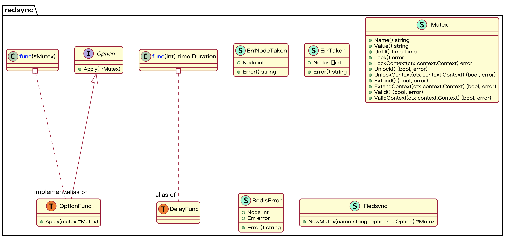
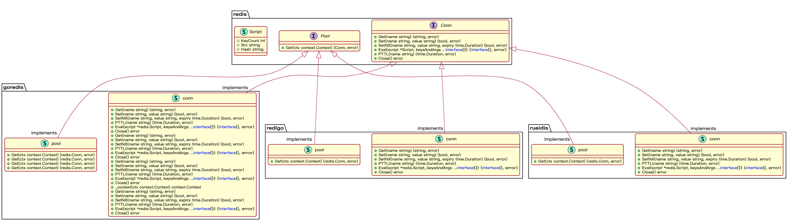

## 1.序言

在涉及到多线程编程时，锁是经常使用到的工具。一般在单机中，如果有多个线程需要修改共享资源，那么就需要使用到锁来对资源进行保护。而在分布式环境中，也会有很多场景需要使用锁来对共享资源进行保护。分布式锁实现有很多种，主要包括:

* 基于数据库实现: 在分布式系统中使用一个共享的数据库实例，利用数据库的事务特性来实现互斥锁。在获取锁时，向数据库中插入一条特定的记录，由于只能有一个事务插入成功，因此只有一个线程能获取到锁。释放锁时，删除掉该记录即可。
* 基于缓存实现: 在分布式系统中使用一个共享的缓存服务(如 Redis、Memcached等)来实现锁。在获取锁时，使用 `SETNX` 命令向缓存中设置一个特定的键值，设置成功的线程才能获取到锁。
* 基于ZooKeeper实现: 在 ZooKeeper 中创建一个独立的节点路径来表示该锁。在获取锁的操作时，尝试在该路径下创建一个顺序临时节点，如果创建成功，则说明获取锁成功，否则等待，直到该路径下的前一个节点被删除。当释放锁时，删除该节点即可。

这里不对各种实现方法的优劣进行评价，单纯从技术的角度，基于现有的开源实现，来看看基于redis实现分布式锁需要考虑哪些。

项目地址: [https://github.com/go-redsync/redsync](https://github.com/go-redsync/redsync)，当前有2.5K star数(截止到2023-06-15)

## 2.案例

这里通过一个简单的案例来看下怎么使用的，基本流程如下:

1. 基于redis库创建一个redis连接池
2. 基于连接池创建Redsync对象
3. 基于Redsync对象创建mutex对象
4. 调用Lock方法获取锁
5. 业务操作
6. 调用Unlock方法释放锁

总体上和使用单机锁时一致的，只不过由于依赖了redis，因此需要进行一些前置的初始化操作。

本案例中，使用两个协程来模拟分布式环境下多节点对共享资源(全局变量counter)的操作。每个协程会对共享变量执行1000000次加一操作，正常情况下结果应该是`2000000`。

```golang
package main

import (
	"fmt"
	"sync"

	"github.com/go-redsync/redsync/v4"
	"github.com/go-redsync/redsync/v4/redis/goredis/v9"
	goredislib "github.com/redis/go-redis/v9"
)

var locker *redsync.Redsync

func init() {
	client := goredislib.NewClient(&goredislib.Options{
		Addr:     "xxx",
		Password: "xxx",
	})
	pool := goredis.NewPool(client)
	locker = redsync.New(pool)
}

var counter = 0

func main() {
	var wg sync.WaitGroup
	wg.Add(2)
	mutexname := "my-global-mutex"
	go increment(mutexname, &wg)
	go increment(mutexname, &wg)
	wg.Wait()
	fmt.Println(counter)
}

func increment(mutexName string, wg *sync.WaitGroup) {
	defer wg.Done()
	mutex := locker.NewMutex(mutexName)
	if err := mutex.Lock(); err != nil {
		panic(err)
	}
	for i := 0; i < 1000000; i++ {
		counter += 1
	}
	if ok, err := mutex.Unlock(); !ok || err != nil {
		panic("unlock failed")
	}
}

```

执行结果如下:

```txt
2000000
2000000
2000000
2000000
2000000
2000000
2000000
```

## 3.项目结构

按照惯例，这里还是先贴一张该项目的类图，以便更好地理解项目结构。





可以看到最重要的结构分别是Redsync和Mutex。至于图2，则涉及到具体redis客户端的实现，基本是对不同redis客户端库封装，大同小异，这里不用关注。

## 4.原理

### 4.1 初始化

基于上面的案例可知，使用redsync分布式锁需要先初始化一个redis连接池，该连接池对象将会作为`Redsync`结构的一个字段。

```golang
type Redsync struct {
	pools []redis.Pool
}

func New(pools ...redis.Pool) *Redsync {
	return &Redsync{
		pools: pools,
	}
}
```

当然这里的连接池并没有直接使用某个具体的实现，而是封装了一个接口。这样的好处就是: 后续如果想替换或用不同的底层实现，这里的逻辑基本不用改动。

从上面的图2可知，该库提供了三种实现， 分别是:

* goredis
* redigo
* rueidis

### 4.2 锁(mutex)对象

完整的对象定义如下:

```golang
type Mutex struct {
	name   string
	expiry time.Duration

	tries     int
	delayFunc DelayFunc

	driftFactor   float64
	timeoutFactor float64

	quorum int

	genValueFunc func() (string, error)
	value        string
	until        time.Time

	pools []redis.Pool
}
```

下面是主要字段及其含义:

* name: 锁的名称，同时也是redis中保存的key
* expire: 锁的超时时间，同时也是redis中该key的过期时间
* tries: 获取锁失败时的重试次数
* delayFunc: 重试时间间隔的计算函数
* driftFactor: 时钟漂移因子
* quorum: 集群模式下，加锁、解锁和续约操作需要在quorum个节点都操作成功，业务才能真正获取到锁
* genValueFunc: 用于生成value的函数
* value: 锁的当前值，也是redis中保存的值
* until: 业务持有锁的截止时间点
* pools: 底层的redis连接池对象

`Redsync`对象提供了一个`NewMutex`方法用于创建锁。在创建时需要指定锁的名称，其他参数如超时时间等可以通过options来进行设置。

```golang
func (r *Redsync) NewMutex(name string, options ...Option) *Mutex {
	m := &Mutex{
		name:   name,
		expiry: 8 * time.Second,
		tries:  32,
		delayFunc: func(tries int) time.Duration {
			return time.Duration(rand.Intn(maxRetryDelayMilliSec-minRetryDelayMilliSec)+minRetryDelayMilliSec) * time.Millisecond
		},
		genValueFunc:  genValue,
		driftFactor:   0.01,
		timeoutFactor: 0.05,
		quorum:        len(r.pools)/2 + 1,
		pools:         r.pools,
	}
	for _, o := range options {
		o.Apply(m)
	}
	return m
}
```

### 4.3 加锁的原理

通过`Mutex`对象的`Lock`方法可以进行加锁，相关定义如下:

```golang
func (m *Mutex) Lock() error {
	return m.LockContext(nil)
}
```

实际上是调用了`LockContext`方法。下面对LockContext的每一部分分别进行分析。

首先调用`genValueFunc`函数生成值，该值将作为value被保存到redis中。默认情况下传入的`genValue`函数会随机生成一个16字节的数并进行base64编码，作为最终的值。


```golang
value, err := m.genValueFunc()
if err != nil {
  return err
}
```

接下来进入一个循环，该循环的主要作用就是进行加锁重试。也就是说如果当前加锁失败，并不会直接就退出，而是进行重试。

这样做的目的是为了提高效率，有的时候可能由于网络延迟等问题，当前并不能直接获取到锁，但是没准重试一下就能成功了。

```golang
for i := 0; i < m.tries; i++ {
	if i != 0 {
		select {
		case <-ctx.Done():
			// Exit early if the context is done.
			return ErrFailed
		case <-time.After(m.delayFunc(i)):
			// Fall-through when the delay timer completes.
		}
	}
  ...
}
```

但是，重试并不是无限制的，频繁重试会降低性能。

因此这里在重试的时候，会等待一个延迟时间。至于等多久，就依赖于传入的`delayFunc`了。默认情况下延迟时间是取(minRetryDelayMilliSec, maxRetryDelayMilliSec)之间的一个随机数。如果希望自定义，也可以通过`WithRetryDelayFunc`进行指定。

```golang
func(tries int) time.Duration {
	return time.Duration(rand.Intn(maxRetryDelayMilliSec-minRetryDelayMilliSec)+minRetryDelayMilliSec) * time.Millisecond
}
```

接下来调用`actOnPoolsAsync`，该函数接收一个匿名函数，内部调用`acquire`方法。这里其实包括两个重要部分:

* `acquire`方法是真正的加锁逻辑，涉及对redis的操作。
* `actOnPoolsAsync`方法内部调用`acquire`方法尝试加锁，也包含了一些保证高可用性的逻辑。

下面依次来看看:

```golang
n, err := func() (int, error) {
  ctx, cancel := context.WithTimeout(ctx, time.Duration(int64(float64(m.expiry)*m.timeoutFactor)))
  defer cancel()
  return m.actOnPoolsAsync(func(pool redis.Pool) (bool, error) {
    return m.acquire(ctx, pool, value)
  })
}()
```

#### 4.3.1 acquire 的作用

这里其实就利用了redis提供的`setnx`是原子指令的特性: 

* 调用该指令设置值时，如果值不存在才能设置成功，如果存在则失败。这一判断和设置过程是原子不可拆分的，因此对同一个KEY的设置只有一个线程能成功。
* 该指令支持设置一个过期时间，设置过期时间和设置值同样是原子操作。

之所以这样是因为: 

假设两个线程A和B同时尝试获取锁，如果A拿到锁之后崩溃了，这把锁就再也无法释放了。锁不释放，其他线程也拿不到锁。因此需要设置一个过期时间来避免这种情况。

另一个考虑是: 如果`setnx`中设置值和设置超时时间是非原子操作，就会出现设置值之后线程崩掉，还没来得及设置超时时间，也会出现上述情况。

所以`setnx`的原子性对于分布式锁来说是很重要的。

```golang
func (m *Mutex) acquire(ctx context.Context, pool redis.Pool, value string) (bool, error) {
	conn, err := pool.Get(ctx)
	if err != nil {
		return false, err
	}
	defer conn.Close()
	reply, err := conn.SetNX(m.name, value, m.expiry)
	if err != nil {
		return false, err
	}
	return reply, nil
}
```

#### 4.3.2 actOnPoolsAsync 的作用

其实如果只是单redis节点的加锁，直接调用`acquire`方法即可。向redis中写一个k-v，写成功则加锁成功，否则加锁失败。

但是单节点存在宕机的风险，会导致服务不可用。redsync在设计的时候考虑了这点。为了保证高可用性，支持了多redis节点。

这里循环对每个连接池执行参数中的函数，也就是`acquire`方法，`r.Status == true`时表示单节点加锁成功，`n`自增一，最后返回。这里n就表示集群中成功获取到锁的节点数。

```golang
func (m *Mutex) actOnPoolsAsync(actFn func(redis.Pool) (bool, error)) (int, error) {
  ...
	ch := make(chan result)
	for node, pool := range m.pools {
		go func(node int, pool redis.Pool) {
			r := result{Node: node}
			r.Status, r.Err = actFn(pool)
			ch <- r
		}(node, pool)
	}
	n := 0
  ...
	for range m.pools {
		r := <-ch
		if r.Status {
			n++
		} 
    ...
	}
  ...
	return n, err
}
```

以上就是`LockContext`方法的核心原理。

上面记录了集群模式中成功获取到锁的节点数，但是上层业务并没有真的获取到锁。在`LockContext`还需要进行一些判断才行:

* 获取到锁的节点数必须至少为`quorum`个，这个数是在创建锁时指定的，默认是`len(r.pools)/2 + 1`，即获取到一半以上的redis节点的锁才算是真的获取到锁。
* 时间比较。锁的生命周期(超时时间expire)包含三部分: 即获取锁所需的时间 + redis服务器漂移时间 + 业务执行耗时。因此业务的执行耗时 = 锁过期时间expire - 获取锁耗时 - redis服务器漂移时间，业务执行的截止时刻(until) = 当前时刻 + 业务的执行耗时。如果当前时间在until之后，表示锁已经过期，那么就需要释放锁了。

只有上面两个条件成立，业务才能真正获取到锁。此时会记录业务执行截止时间和redis中保存的值。

```golang
now := time.Now()
until := now.Add(m.expiry - now.Sub(start) - time.Duration(int64(float64(m.expiry)*m.driftFactor)))
if n >= m.quorum && now.Before(until) {
  m.value = value
  m.until = until
  return nil
}
```

### 4.4 解锁原理

同加锁类似，解锁时调用`Unlock`方法，该方法也会调用对应的`UnlockContext`。

其中`actOnPoolsAsync`和加锁时一样，所以这里也会有延时重试的逻辑以及记录解锁成功的节点数，并且将其和`quorum`进行比较，只有超过一半节点以上解锁成功，业务才能真正的释放锁。

```golang
func (m *Mutex) Unlock() (bool, error) {
	return m.UnlockContext(nil)
}

func (m *Mutex) UnlockContext(ctx context.Context) (bool, error) {
	n, err := m.actOnPoolsAsync(func(pool redis.Pool) (bool, error) {
		return m.release(ctx, pool, m.value)
	})
	if n < m.quorum {
		return false, err
	}
	return true, nil
}
```

核心在于`release`方法。能不能直接把KEY从redis中删掉呢?

思考这样一个场景: 

线程A获取到锁并设置了一个过期时间，但是在主动释放锁之前，锁过期时间到自动释放了。此时线程B拿到了锁，然后线程A调用Unlock企图释放锁。

如果直接删除KEY，线程A就会把线程B的锁释放掉，显然不行。

创建锁时指定的`genValue`函数采用随机数生成value，基本可以保证一定程度上value的唯一性；释放锁时，将当前线程的锁对象中记录的value和redis中保存的值进行比较，如果一致，则说明该锁是当前线程加的，那么也就不会出现场景中误删的问题。

redis中执行lua脚本时可以将多个redis命令组合成一个原子操作，因此通过脚本就可以实现类似`compare_and_set`的功能。

```golang
var deleteScript = redis.NewScript(1, `
	if redis.call("GET", KEYS[1]) == ARGV[1] then
		return redis.call("DEL", KEYS[1])
	else
		return 0
	end
`)
func (m *Mutex) release(ctx context.Context, pool redis.Pool, value string) (bool, error) {
	conn, err := pool.Get(ctx)
	if err != nil {
		return false, err
	}
	defer conn.Close()
	status, err := conn.Eval(deleteScript, m.name, value)
	if err != nil {
		return false, err
	}
	return status != int64(0), nil
}
```

### 4.5 如何续约

设置过期时间能够保证业务宕机时锁能够正常释放，但是需要考虑的问题是: 过期时间要设置多久?

* 过期时间过短，会影响业务的正常运行
* 过期时间过长，线程崩溃时会带来较长时间的阻塞

即使设置的过期时间能够cover住大多数情况，也总会有个例。一旦业务还在正常执行但是锁已经自动释放了，就会带来问题。这就需要一种机制，能够自动地进行锁的续约。

redsync并没有完全实现自动续约的能力，但是提供了`Extend`方法来帮助我们进行续约操作。

```golang
func (m *Mutex) Extend() (bool, error) {
	return m.ExtendContext(nil)
}

func (m *Mutex) ExtendContext(ctx context.Context) (bool, error) {
	start := time.Now()
	n, err := m.actOnPoolsAsync(func(pool redis.Pool) (bool, error) {
		return m.touch(ctx, pool, m.value, int(m.expiry/time.Millisecond))
	})
	if n < m.quorum {
		return false, err
	}
	now := time.Now()
	until := now.Add(m.expiry - now.Sub(start) - time.Duration(int64(float64(m.expiry)*m.driftFactor)))
	if now.Before(until) {
		m.until = until
		return true, nil
	}
	return false, ErrExtendFailed
}
```

总体上和加锁、解锁一致，都有`quorum`判断和截止时间判断。

唯一的不同在于这里`actOnPoolsAsync`会调用`touch`方法进行锁在单节点的续约。原理上和释放锁类似，都是通过lua脚本原子地进行value的比较并调用redis的`PEXPIRE`指令重新设置过期时间。

```golang
func (m *Mutex) touch(ctx context.Context, pool redis.Pool, value string, expiry int) (bool, error) {
	conn, err := pool.Get(ctx)
	if err != nil {
		return false, err
	}
	defer conn.Close()
	status, err := conn.Eval(touchScript, m.name, value, expiry)
	if err != nil {
		return false, err
	}
	return status != int64(0), nil
}

var touchScript = redis.NewScript(1, `
	if redis.call("GET", KEYS[1]) == ARGV[1] then
		return redis.call("PEXPIRE", KEYS[1], ARGV[2])
	else
		return 0
	end
`)
```

在业务中使用时，可以为锁设置一个自动续约的协程，每隔一段时间调一次`Extend`方法进行续约。同时，业务和续约协程之间通过channel传递信息，以保证业务正常退出时续约协程能够关闭。

## 5.总结

以上基于redsync介绍了基于redis实现分布式锁需要考虑的点，主要包括:

* 利用`setnx`指令的原子性实现锁的互斥，加锁失败时按照一定延迟策略进行重试
* 加锁时指定超时时间避免持锁线程崩溃时导致的死锁
* 释放锁时为了防止误删，每个线程获取锁时都必须设置一个唯一值，删除时利用lua脚本原子地进行值的比较
* 为了保证高可靠性，可以设置多节点，此时加锁、解锁、续约操作需要在一定数量的节点上都执行成功，业务才能真正完成对应操作。


