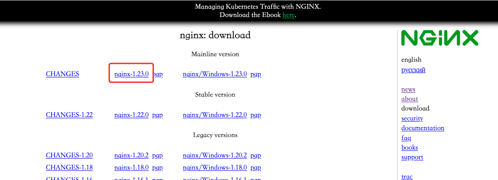
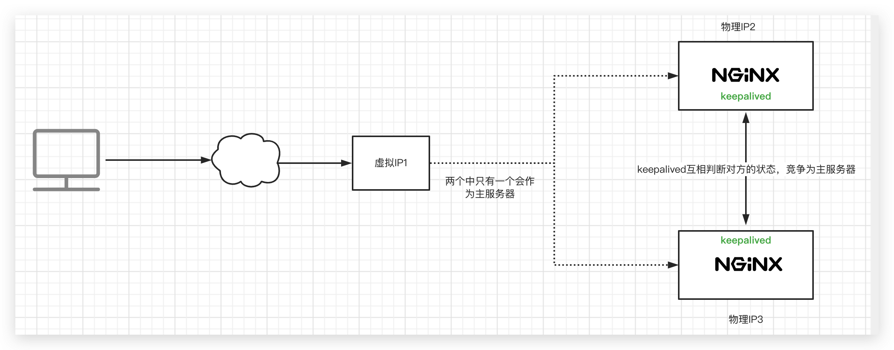

> 环境搭建:

```shell
#!/bin/bash
docker run --name nginx -p 80:80 -d nginx
```

# nginx 基础

## 常见版本

一般分为四大阵营

- **nginx 开源版**: http://nginx.org/

  官方原始的 nginx 版本

- **nginx plus 商业版**: https://www.nginx.com/products/nginx/

  开箱即用，集成了大量功能

- **Tenging**: https://tengine.taobao.org/

  由淘宝网发起的 Web 服务器项目。它在 nginx 开源版的基础上，针对大访问量网站的需求，添加了很多高级功能和特性。Tengine 的性能和稳定性已经在大型的网站如淘宝网、天猫商城等得到了很好的检验。相比于 Open Resty，扩展性不够强，但是能够满足绝多数使用场景

- **OpenResty**: http://openresty.org/

  基于 nginx 和 lua 的高性能 web 平台，其内部集成了大量精良的 Lua 库、第三方模块以及大多数的依赖项。**更适用于需要大量二次开发的场景，有极强的扩展性**

> Tengine 和 Openresty 是开源版本

## 编译安装

**1.下载**

从[官网](http://nginx.org/en/download.html)下载 nginx 安装包，上传到虚拟机并解压



**2.依赖检查与安装**

执行以下命令进行依赖检查

```shell
./configure --prefix=/usr/local/nginx
```

先把缺少的依赖安装上，一般来说，安装以下依赖即可

```shell
#安装C编译器
yum install -y gcc

#安装pcre库
yum install -y pcre pcre-devel

#安装zlib
yum install -y zlib zlib-devel
```

然后执行`make && make install`命令进行编译和安装，安装后的 nginx 位于`/usr/local/nginx`目录下

**3.关闭防火墙**

```shell
systemctl disable firewalld --now
```

**4.启停 nginx**

在`/usr/local/nginx/sbin`目录下有一个 nginx 可执行文件，其提供的命令包括:

- 启动: `nginx`
- 快速停止: `nginx -s stop`
- 优雅停止: `nginx -s quit`
- 重载配置: `nginx -s reload`
- 测试配置: `nginx -t`

**5.服务注册**

将 nginx 配置成系统服务，避免直接使用启动脚本启动

首先在`/usr/lib/systemd/system`目录下创建 nginx.service 文件，内容如下:

```txt
[Unit]
Description=nginx
After=network.target remote-fs.target nss-lookup.target

[Service]
Type=forking
PIDFile=/usr/local/nginx/logs/nginx.pid
ExecStartPre=/usr/local/nginx/sbin/nginx -t -c /usr/local/nginx/conf/nginx.conf
ExecStart=/usr/local/nginx/sbin/nginx -c /usr/local/nginx/conf/nginx.conf
ExecReload=/usr/local/nginx/sbin/nginx -s reload
ExecStop=/usr/local/nginx/sbin/nginx -s stop
ExecQuit=/usr/local/nginx/sbin/nginx -s quit
PrivateTmp=true

[Install]
WantedBy=multi-user.target  # 多用户
```

关于`Type`的配置:

- simple: 默认值，ExecStart 启动的进程为主进程，服务的生命周期跟随主进程
- forking: ExecStart 启动的进程以 fork()方式启动，父进程退出，子进程成为主进程

然后重新加载服务的配置

```shell
systemctl daemon-reload
```

最后启动服务

```shell
systemctl start nginx.service
```

## 目录结构

nginx 安装的根目录是`/usr/local/nginx`，其目录结构如下:

```txt
├── client_body_temp
├── conf
│   ├── nginx.conf
│   ├── *.conf
├── fastcgi_temp
├── html
│   ├── 50x.html
│   └── index.html
├── logs
│   ├── access.log
│   ├── error.log
│   └── nginx.pid
├── proxy_temp
├── sbin
│   ├── nginx
│   └── nginx.old
├── scgi_temp
└── uwsgi_temp
```

各目录作用如下:

- **conf**: 存放配置文件，其中`nginx.conf`是主配置文件，其他配置文件都在主配置文件中有引用
- **html**: 存在一些默认的页面
- **log**:
  - **access.log:** 访问日志
  - **error.log**: 错误日志
  - **nginx.pid**: 存放进程号
- **\*\_temp**: 存放一些临时文件

## 运行原理

一主多从架构

master 进程负责对配置文件进行读取和校验、以及协调管理 worker 进程

worker 进程负责处理客户端请求

## 基本配置

下面是 nginx.conf 文件最基本的配置

```json
// worker进程数
worker_processes  1;

events {
    // 每个worker进程的连接数
    worker_connections  1024;
}


http {
    // include是引入关键字，这里引入了mime.types这个配置文件，该文件定义了响应的类型
    include       mime.types;

    // mime.types文件中未定义的类型，默认类型为application/octet-stream
    default_type  application/octet-stream;

    // 开启时内核直接将文件写到网络接口，不需要先复制到程序的内存空间
    sendfile        on;

    // 长连接超时时间
    keepalive_timeout  65;

		// 一个nginx可以启用多个server(虚拟服务器)
    server {

        // 监听端口80
        listen       80;

        // 请求的域名
        server_name  localhost;

        location / {

            // 根目录指向html目录
            root   html;

            // 请求路径为index时访问index.html文件
            index  index.html index.htm;
        }

        // 响应状态码为500/502/503/504时，转到50x.html文件
        error_page   500 502 503 504  /50x.html;

        // 到root指定的目录下寻找50x.html文件
        location /50x.html {
            root   html;
        }

    }
}
```

## 虚拟主机和配置规则

原本一台服务器只能配置一个站点，通过虚拟主机技术能够虚拟化出多个站点同时对外提供服务

nginx 通过配置`server_name`为虚拟主机配置域名，并提供了以下几种配置规则:

> server_name 匹配时按配置的域名的先后顺序进行匹配

**1.完整匹配**

可以写多个，如:

```txt
server_name a.test.com b.test.com;
```

**2.通配符匹配**

如:

```txt
server_name a.*.com;
```

**3.通配符匹配**

如:

```txt
server_name ~^[a-z]+\.test\.com$;
```

正则匹配规则可参考https://blog.csdn.net/yangyelin/article/details/112976539

## 反向代理

反向代理服务器出现在服务器端，本质上就是网关

通过在`location`下配置`proxy_pass`属性可以为网站配置反向代理

配置了`proxy_pass`之后，`root`和`index`字段的配置就会失效

如下面的配置，访问http://a.test.com:80时，实际会将请求转发到http://www.baidu.com

> proxy_pass 配置不支持**https**协议

```json
worker_processes  1;
events {
    worker_connections  1024;
}
http {
    include       mime.types;
    default_type  application/octet-stream;
    sendfile        on;
    keepalive_timeout  65;
    server {
        listen       80;
        server_name  a.test.com;
        location / {
  					proxy_pass  http://www.baidu.com;
        }
        error_page   500 502 503 504  /50x.html;
        location /50x.html {
            root   html;
        }

    }
}
```

## 负载均衡

### 轮询访问

通过`upstream`关键字为一组地址配置别名，然后将`proxy_pass`指定为该别名，则实际访问的地址将会在这一组地址中切换

> 这种方式存在一个问题: 无法保持会话

```json
worker_processes  1;
events {
    worker_connections  1024;
}
http {
    include       mime.types;
    default_type  application/octet-stream;
    sendfile        on;
    keepalive_timeout  65;
    upstream test{
  		  server 192.168.0.1;
        server 192.168.0.2;
		}
    server {
        listen       80;
        server_name  a.test.com;
        location / {
  					proxy_pass  http://test;
        }
        error_page   500 502 503 504  /50x.html;
        location = /50x.html {
            root   html;
        }

    }
}
```

### 设置权重

上述轮询访问时没有为这一组地址设置权重，默认权重就是 1

可以为其设置不同的权重以改变某台服务器的访问频率

```json
upstream test{
  server 192.168.0.1 weight=10;
  server 192.168.0.2 weight=80;
}
```

### 停止负载均衡和备用机配置

同样在 upstream 关键词中配置

```json
upstream test{
  server 192.168.0.1 weight=10 down;
  server 192.168.0.2 weight=80 backup;
}
```

设置为 down 的机器不再参与负载均衡

设置为 backup 的机器作为备用机，其他机器无法使用时才会提供服务

### 其他负载均衡策略

了解即可

- ip_hash
- least_conn: 最少连接优先
- url_hash
- fair: 根据后端服务器的响应时间转发(有流量倾斜风险)

## 动静分离

将动态请求分配到后端的服务器进行处理，静态资源放到 NGINX 服务器上，直接由 nginx 进行处理，适合于中小型网站等静态资源较少的网站。

需要将静态资源如 js、css 和 img 资源放到 html 目录下，然后进行如下配置

```json
 server {
        listen       80;
        server_name  a.test.com;
        location / {
  					proxy_pass  http://test;
        }
        location /css {
  					root  html;
        }
        location /js {
  					root  html;
        }
        location /img {
  					root  html;
        }
        error_page   500 502 503 504  /50x.html;
        location = /50x.html {
            root   html;
        }
    }
```

> `/`的配置优先级较低，会先进行其他 location 的匹配

上述配置可以利用正则匹配进行简化

```json
location / {
  proxy_pass  http://test;
}
location ~*/(css | js | img) {
  root  html;
}
```

> nginx 提供了多种匹配方式:
>
> - `/`: 通用匹配，所有的请求都会匹配到，优先级最低
> - `~`: 正则匹配，区分大小写
> - `~*`: 正则匹配，不区分大小写
> - `=`: 上述匹配当时都是前缀匹配，此方式是精准匹配

## URL 重写

通过`rewrite`关键词对访问的 URL 的进行重写，以达到隐藏后端真实路径和请求参数的目的

例如下面的例子中，后端的真实路径是/index.jsp?pageNum=$1，将其重写为/([0-9]+).html

这样在浏览器就可以通过访问/1.html 来访问/index.jsp?pageNum=1，从而隐藏掉 pageNum 参数

```json
server {
    listen       80;
    server_name  localhost;
    location / {
        rewrite ^/([0-9]+).html$ /index.jsp?pageNum=$1  break;
        proxy_pass http://xxx;
  	}
    error_page   500 502 503 504  /50x.html;
    location = /50x.html {
       root   html;
    }
}
```

`rewrite`使用方式如下:

```shell
rewrite <regex> <replacement> <flag>
```

regex 表示浏览器访问的地址

replacement 表示后端实际访问的地址

flag 可以有以下配置:

- break: 当前匹配后立即退出，不进行后续匹配
- last: 继续匹配直接最后一个规则
- redirect: 302 临时重定向，浏览器地址会改变
- permanent: 301 永久重定向，浏览器地址会改变

## 防盗链

请求一个页面时，浏览器会自动请求页面中的静态资源，此时请求头中有一个`refer`字段，表示该请求的来源。

可以通过限制请求的来源来避免第三方网站直接引用本站的静态资源。

使用方式如下:

```shell
valid_referers none | blocked | server_names | strings ....;
```

- none: 检测 referer 域不存在的情况
- blocked: 检测 referer 域被防火墙或者代理删除或伪装的情况，不常用
- server_name: 设置一个或多个 URL，检测 referer 域是否是这些值中的一个

实例配置如下，这种配置下，对于盗链请求会被跳转到 401.html 上

```json
valid_referers 192.168.44.101;
if ($invalid_referer) {
  	return 401;
}

error_page   401  /401.html;
location = /401.html {
	root   html;
}
```

有时候对于盗链图片，可能需要返回一张默认的图片，可以进行如下配置

```json
valid_referers 192.168.44.101;
if ($invalid_referer) {
  	rewrite ^/ /img/x.png break;
}
```

## 高可用场景

### 简介



引入了虚拟 IP，用户访问时访问这个虚拟 IP，keepalived 会选定一个 nginx 服务器作为 master，将这个虚拟 IP 分配给 master

每个节点上的 keepalived 进程会相互通信，以确定其他服务器的状态，如果 master 挂掉，会通过竞选机制从剩下的服务器中选出一个新的 master

### 安装

直接通过 yum 安装即可

安装完成后 keepalived 的配置文件位于`/etc/keepalived/keepalived.conf`

下面配置两台机器的高可用，修改配置后启动 keepalived 服务即可

**master 配置**

```txt
! Configuration File for keepalived

global_defs {
   router_id nginx1
}

vrrp_instance VI_1 {
    state MASTER
    interface eth33
    virtual_router_id 51
    priority 100
    advert_int 1
    authentication {
        auth_type PASS
        auth_pass 1111
    }
    virtual_ipaddress {
        192.168.108.244
    }
}
```

**backup 配置**

```txt
! Configuration File for keepalived

global_defs {
   router_id nginx2
}

vrrp_instance VI_1 {
    state BACKUP
    interface eth33
    virtual_router_id 51
    priority 99
    advert_int 1
    authentication {
        auth_type PASS
        auth_pass 1111
    }
    virtual_ipaddress {
        192.168.108.244
    }
}
```

关于配置有一些注意的点:

- `router_id`是唯一的
- `state`只能有一个 MASTER，其他为 BACKUP
- `priority`指定竞选 master 的优先级
- `interface`指定网口，可通过`ip addr`查看
- `vrrp、 virtual_router_id、authentication、virtual_ipaddress`需配置一样，nginx 服务器才能再一个组里

## 证书配置

从云服务提供商处申请到证书之后，将证书和私钥文件上传到 nginx 服务器所在的主机上，例如上传到 nginx 安装目录的 conf 目录下

然后在 nginx.conf 中配置即可

```json
server {
	listen 443了;
  ss1 on;
	ss1_certificate  xxx.pem; #这里是证书路径
	ss1_certificate_key  xxx.key  #这里是私钥路径
}
```


