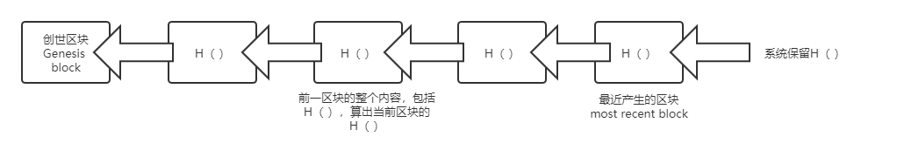
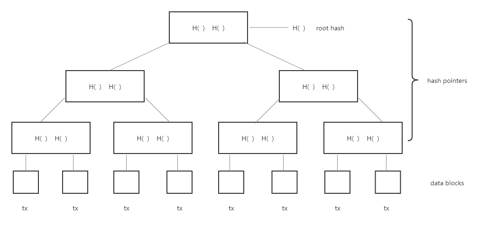
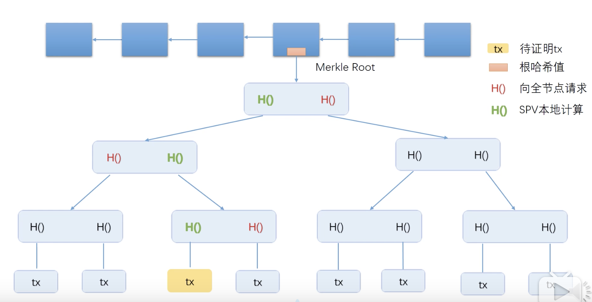

> 整理自 [北京大学肖臻老师《区块链技术与应用》公开课](https://www.bilibili.com/video/BV1Vt411X7JF?from=search&seid=14488407572640514229)

### 哈希指针

普通指针存储的是某个结构体在内存中的地址。哈希指针不仅保存地址，还保存hash值 H( )。这样不仅能找到位置，还能检测出内容是否被篡改。

比特币最基本的数据结构是**区块链**，就是一个个区块组成的链表。

和普通区块的区别：**哈希指针代替普通指针**

下面是一个区块链的例子:

通过这样的数据结构可以实现防篡改日志(tamper-evident log)，如果修改某个区块的内容，则后面区块的H()对不上，包括系统保留的H()都需要修改。所以只需要记住最后一个H()，就能检测出对区块链的任何修改。

普通链表可以改变其中一个元素，对链表中其他元素是没有影响的。而区块链牵一发而动全身。有这个性质，比特币中有些节点，就没必要保存整个区块链的内容，可以只保存最近几千个区块。如果用到其他区块，可以问系统中其他节点要这个区块。有些节点可能有恶意，给的区块不一定正确，可以通过哈希指针的性质，算出该区块的哈希值，和保存的哈希值对比即可知道是否正确。

### Merkle Tree

其与Binary Tree的区别是: **哈希指针代替普通指针**

下面是一个例子：

这种结构的好处是只要记住root hash，就能检测出对树中任何位置的修改。因为只要一个数据块修改，根hash值也会修改

比特币中，各区块之间用哈希指针连接在一起，每个区块内所包含的交易组织成merkle tree。上图的每一个每个数据块实际是一个交易。

每个区块块分为块头（block header）和块身（block body）两部分。区块所包含的所有交易组成的merkle tree的root hash存在header中，但header中没有交易的具体内容，只有root hash。body中有具体的交易列表。

Merkle tree作用：**提供merkle proof**

比特币中的节点分为两类：**全节点和轻节点**。其中全节点保存整个区块的内容，轻节点只保存header。向轻节点证明某交易写在了区块链中，就用到merkle proof（从交易所在位置到root hash的路径）。

下面是merkle proof的示意图:

最上面一行是小型区块链，最下面一行是交易。假设某个轻节点想要知道黄色交易是不是包含在merkle tree里面，轻节点没有保存交易列表，也没有merkle tree的具体内容，只有root hash。轻节点向某个全节点发出请求，请求一个能够证明黄色交易被包含在merkle tree中的merkle proof。全节点收到请求后，把图中红色的哈希值发给轻节点。有了这些哈希值，轻节点在本地可以依次计算出图中标为绿色的哈希值，最后可以算出整棵树的root hash值。轻节点把算出的哈希值和block header中的哈希值比较，就知道黄色交易是不是包含在merkle tree中。

> **问题**

1. proof of membership / proof of inclusion（证明merkle tree里面包含了某个交易）

   可以通过merkle proof证明，其时间复杂度为$\theta\bigg(log(n)\bigg)$

2. proof of non-membership

   比较笨的方法是遍历，时间复杂度是$\theta(n)$

   更高效的方法是对每一个交易按照hash值排序，然后用二分法查找，这样时间复杂度是$\theta\bigg(log(n)\bigg)$，这种称为Sorted merkle Tree

