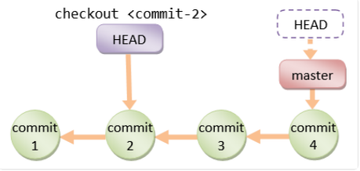

## 常用操作

下面的几个命令基本能满足大部分需求:

* `git clone`
* `git config`
* `git branch`
* `git checkout`
* `git status`
* `git add`
* `git commit`
* `git push`
* `git pull`
* `git log`
* `git tag`

### git clone

从远程仓库拉取仓库到本地，本地会出现一个以仓库名命名的文件夹

```shell
git clone git@github.com:Tiansir-wg/git-study.git
```

### git config

配置开发者用户名和邮箱

```shell
git config user.name="xxx"
git config user.email="xxx@xxx.com"
```

每次提交代码代码时会生成一条记录，记录里面包含了配置的用户名和邮箱

### git branch

用于创建、查看、重命名和删除分支

一般开发时在开发分支进行，开发完成后合并到主分支

> 1.创建分支

创建一个名为study/0.0.0的开发分支

```shell
git branch study/0.0.0
```

> 2.重命名

通过指定`-m`参数将分支study/0.0.0重新命名为study/0.0.1

```shell
git branch -m study/0.0.0 study/0.0.1
```

> 3.查看分支

通过不带参数的`branch`命令查看当前项目的分支列表

当前所处的分支前会带一个星号

```shell
git branch 
```

> 4.删除分支

通过指定`-d`参数删除分支

```shell
git branch -d study/0.0.1
```

### git checkout

用于切换分支，后续操作将会在该分支上进行

```shell
git checkout study/0.0.1
```

### git status

修改README.md文件后使用该命令查看

```shell
git status
```

结果如下，`Changes not staged for commit`表示修改还未保存到暂存区。

```shell
On branch study/0.0.1
Changes not staged for commit:
  (use "git add <file>..." to update what will be committed)
  (use "git checkout -- <file>..." to discard changes in working directory)

	modified:   README.md

no changes added to commit (use "git add" and/or "git commit -a")
```

### git add

将**工作区**的文件变动保存到暂存区

可以指定文件名，也可以使用`git add .`将全部文件保存到暂存区

```shell
git add README.md
```

再次使用git status查看状态，结果如下，`Changes to be committed`表示文件还未提交到本地仓库

```shell
On branch study/0.0.1
Changes to be committed:
  (use "git reset HEAD <file>..." to unstage)

	modified:   README.md
```

### git commit

将**暂存区**的文件提交到**本地版本库**

通过`-m`参数指定提交信息

```shell
git commit -m "提交信息"
```

### git push

将**本地版本库**的内容推送到**远程版本库**

其中`origin`代表远程版本库地址，下面的命令将study/0.0.1这个分支推送到远程版本库

```shell
git push origin study/0.0.1
```

### git pull

从远程版本库拉取最新代码

如果别的成员对代码进行了修改并提交到了远程仓库，那么就需要将远程仓库上最新的代码拉取到本地

如果线上代码做了修改，而本地也进行了修改，那么就可能会产生冲突。一般情况会自动处理冲突，但是如果修改的是同一行，那么就需要手动处理冲突后再提交

```shell
git pull origin study/0.0.1
```

手动处理冲突时，先将本地的修改提交到本地仓库，再次拉取时文件中就会同时出现冲突的内容。

### git log

查看版本提交历史信息

包括提交人、邮箱、提交原因等信息

```shell
git log
```

### git tag

为项目添加里程碑

一般项目上线前，将项目的所有代码做个标记，表示一个版本

```shell
git tag publish/0.0.1
git push origin publish/0.0.1
```

### .gitignore

该文件用于指定不需要进行版本控制的目录或文件

## 深入探索

### 基本概念

#### 工作区

所有的代码修改都是在工作区进行的，也是能直接看到的目录

#### 本地版本库

工作区目录下有一个`.git`隐藏文件，这个文件就是本地版本库


#### 暂存区

本地版本库中有很多东西，暂存区就是其中之一，也称为`stage`或者`index`

git还会在本地版本库中创建一个默认的main分支，以及指向`main`分支的指针`HEAD`

#### 远程仓库

一般是远程服务器上对应的仓库，如github

#### 分支

分支是为了让不同的人能够并行开发且不会相互影响

#### 主分支

即main分支，是git默认创建的分支

其他分支开发完后需要合并到主分支


#### 标签

标签用于标记分支上特定的点，表示一个版本，通常包括版本的名称和版本号

#### HEAD

表示当前分支的最近一次提交



### 工作区、暂存区、本地库和远程库的关系


### 操作文件命令

#### git add

**用于将文件添加到暂存区**

> git add -i

通过`git add -i`进行交互系统，显示结果如下:

```shell
*** Commands ***
  1: status	  2: update	  3: revert	  4: add untracked
  5: patch	  6: diff	  7: quit	  8: help
```

通过输入相应的序号或者命令首字母选择相应的功能:

* `status`: 查看文件状态
* `update`: 详见下方`git add -u`
* `revert`: 将添加到暂存区的文件从**暂存区**移除
* `add untracked`: 将新增的文件添加到暂存区
* `patch`: 详见下方`git add -p`
* `diff`: 比较**暂存区**文件和**本地库**文件的差异
* `quit`: 退出交互系统
* `help`: 查看帮助信息

> git add -p

将**工作区**与**本地库**的内容进行比较，以决定是否将修改添加到**暂存区**

可以选择如下操作:

* `y`: 接受修改
* `n`: 忽略修改
* `q`: 退出
* `a`: 添加修改
* `d`: 放弃修改
* `/`: 通过正则表达式匹配修改内容
* `?`: 查看帮助信息

具体可查看 https://blog.csdn.net/keocce/article/details/106471132

> git add -u

用于将所有tracked文件中**被修改过**或**已删除文件**的信息添加到暂存区，忽略untracted的文件

进入交互命令的update模式，会列出工作区**修改**或**删除**的文件列表，**新增**的文件不会列出

输入文件序号表示选中了该文件，回车继续选择。全部选好后回车会退出到命令主界面

> git add --ignore-removal

将工作区中**新增**和**修改**的文件添加到暂存区，忽略**删除**的文件

#### git commit

**用于将暂存区的文件提交到本地库**

> 1.输入多行提交原因

```shell
git commit -m "第一行" -m "第二行"
```

> 2.直接提交暂存区的修改

对于已经tracked的文件，直接将其commit，不用先add

对于untracked的文件，还是需要先add

```shell
git commit -am "xxx"
```

> 3.修改上一次提交的提交原因

一般用于提交消息写错需要修改的情况，这种方式不会出现在提交历史里面

```shell
git commit --amend -m "yyy"
```

> 4.在上次提交中附加一些内容

```shell
git add . && git commit -amend --no-empty
```

> 5.空提交--用于重新触发CI

```shell
git commit --allow-empty -m "chore:re-trigger build"
```


#### git mv

**对文件或目录进行移动**

功能类似于`mv`命令，只不过通过`git mv`所做的修改会同时添加到暂存区，不需要add

```shell
git mv README.md README1.md 
```

#### git rm

**从工作区和暂存区移除文件**

功能类似于`rm`命令，只不过通过`git rm`所做的修改不需要add

```shell
git rm README.md
```

### 操作分支命令

#### git branch

**用于查看、创建和删除分支**

> 1.查看本地库和远程库上的分支列表

```shell
git branch -a
```

> 2.强制删除分支

使用`-D`参数，相当于`-d -f`

即使该分支有提交未被合并也会删除

```shell
git branch -D study/0.0.1
```

> 3.对远程仓库的分支进行操作

指定`-r`参数

例如只列出远程仓库的分支列表

```shell
git branch -r
```

> 4.查看分支的详细信息

指定`-v`参数查看带有最近一次提交ID和提交原因的分支列表

指定`-vv`参数还能显示该分支的上游分支

```shell
git branch -vv
```


#### git merge

**将其他分支合并到当前分支**

> git merge --squash

将待合并分支合并到当前分支，并且将该分支上的commit记录压缩成一个新的commit，适用于待合并分支上的历史记录不需要保存的情况

https://www.cnblogs.com/lookphp/p/5799533.html

> git merge --no-ff

默认情况下会采用`fast-forward`模式，即快进式合并，直接将master指向待合并分支，但是该模式仅限于两个分支可达的情况，如果两个分支不可达，则需要进行合并，这时候就需要指定`--no-ff`


https://blog.csdn.net/qq_40999917/article/details/103316870

> git merge --no-edit

在没有冲突的情况合并，使用自动生成的信息作为提交原因

#### git checkout

**用于切换分支**

> 创建并切换分支

等同于`git branch study/0.0.2`和`git checkout study/0.0.2`的组合

```shell
git checkout -b study/0.0.2
```

> 检出单个文件

从**本地版本库**的HEAD(或者指定的提交ID、分支名、tag名)处检出指定文件并覆盖当前**工作区**的文件

如果不指定HEAD则默认从**暂存区**检出

```shell
git checkout HEAD README.md
```

> 忽略历史记录创建新分支

该命令会创建一个新的、完全没有历史记录的新分支，但源分支上所有的文件都还在。

新分支必须要commit一次还会成为一个真正的分支

```shell
git checkout --orphan xxx
```

> 比较分支差异

还提供了交互式界面以便进一步操作

```shell
git checkout -p xxx
```

> 切换到上一个分支

```shell
git checkout -
```


#### git stash

**用于将当前工作区和暂存区的内容暂时保存在栈中，从而能够在不提交当前分支的情况下切换分支**

> 将当前分支未提交的内容暂存在栈中

**只能暂存tracked的内容**

```shell
git stash
```

> 查看栈中保存的列表

```shell
git stash list
```

> 显示栈中保存的某一条记录

```shell
git stash show stash@{0}
```

> 移除栈中的一条记录

```shell
git stash drop stash@{0}
```

> 从栈中检出一条记录并将其从栈中移除

```shell
git stash pop stash@{0}
```

> 从栈中检出一条记录但不从栈中移除

```shell
git stash apply stash@{0}
```

> 清空栈中记录

```shell
git stash clear
```

> 创建一个新分支并将栈中的一条记录应用到新分支

```shell
git stash branch xxx stash@{0}
```

> 创建一个栈条目

会返回一个ID，但是不会真的暂存到栈中，需要集合`git stash store`使用

一般在脚本中使用

```shell
git stash create 
```

> 保存创建的栈条目到栈中

```shell
git stash store xxx
```

#### git cherry-pick

**用于将其他分支的某一个commit合并到当前分支并产生一个新的commit**

https://zhuanlan.zhihu.com/p/357770707

```shell
git chery-pick e8b602b
```

#### git reset

**用于将当前分支重置到某个commit位置**

https://blog.csdn.net/kusedexingfu/article/details/103333566

> git reset --mixed xxx

`--mixed`是默认的参数

该操作会回退**暂存区**和**版本库**

> git reset --soft xxx

只回退版本库的HEAD，不回退暂存区和工作区

> git reset --hard xxx

将工作区、暂存区和版本库全部回退

#### git revert

**撤销某次提交，并保留其后面的提交历史**

其实是通过生成一个新的逆操作提交来实现的

> git revert HEAD

撤销最近一次提交

> git revert HEAD --no-edit

撤销最近一次提交，并使用默认的提交信息

> git revert -n HEAD

撤销多次提交

这种情况不会生成多个新的提交操作，而是所有撤销完成后生成一个提交

#### git rebase

变基操作

https://blog.csdn.net/weixin_42310154/article/details/119004977

> git rebase xxx

以xxx作为当前分支的base

#### git fetch 

用于将远程仓库同步到本地

> 移除远程仓库上不存在的分支

```shell
git fetch -p
```


### 操作历史

#### git log

**用于显示提交历史**

https://blog.csdn.net/weixin_39967072/article/details/119452318

> git log -p

显示带有提交差异对比的历史记录

> git log README.md

显示单个文件的提交历史

> git log --since="2 weeks age"

显示两周前到现在的历史记录

> git log --before="2 weeks age"

显示截止到两周前的记录

> git log -2

显示最近两条记录

> git log e8b602b..HEAD

显示e8b602b到HEAD之间的记录

> git log --oneline

在每一行显示简短的提交信息

> git log --all --grep="xxx"

在所有提交记录中查找包含xxx的提交

> git log --author="xxx"

查找某人的提交日志


#### git diff

**用于查看工作区、暂存区和版本库之间的文件差异**

> git diff

比较**工作区**和**暂存区**的文件差异

> git diff <commit_id>/HEAD

比较**工作区**和**commit_id**或**HEAD**之间的文件差异

> git diff --cached或--staged

比较**暂存区**和**HEAD**之间的文件差异

> git diff xxx yyy

比较两个commit的文件差异

#### git reflog

**可用于查看所有分支的所有操作记录**

而`git log`只能查看commit记录，且不能查看被删除的commit记录

https://blog.csdn.net/Seky_fei/article/details/114729213

### 问题排查

#### git blame

**用于追溯文件的历史修改记录，能够显示文件每行的最后一次修改记录**

https://zhuanlan.zhihu.com/p/448632974

```shell
git blame -L 1,10 b.txt
```

#### git bisect

**使用二分查找寻找有问题的提交**

> git bisect start

开始

> git bisect good/bad

标记当前提交时无/有问题

> git bisect reset

找到有问题的提交ID后回到原分支

### 子模块

#### git submodule

对当前版本库中的子模块(另一个版本库)进行操作

> 添加子模块

将另一个版本库添加为当前模块的子模块

```shell
git submodule add https://gitee.com/mlogclub/bbs-go.git bbs
```

> 更新子模块

```shell
git submodule update bbs
```

### 垃圾回收

#### git gc

用于清理松散对象

http://t.zoukankan.com/linhaostudy-p-8349912.html

### 导出代码

#### git archive

用于将代码打包，打包代码中没有.git文件夹

```shell
git archive --format zip main > main.zip
```

### GitFLow分支模型

* 主分支(每个类型分支只能有一个)
  * master分支: 存放可以随时部署到线上环境的代码
  * develop分支: 用于保存最新的开发成果，稳定后可以合并到master分支
* 辅助分支(每个类型分支可以有多个)
  * feature分支: 开发新功能时使用，最终合并到develop分支
  * release分支: 做小的缺陷修正、准备发布版本所需要的说明信息
  * hotfix分支: 负责线上代码的紧急修复工作


