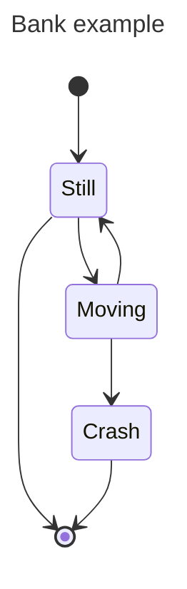

## 1.前言

想必初次接触markdown的同学可能会很疑惑，作为文字记录工具，word已经为我们提供了如此强大且丰富的功能，为什么还需要使用markdown呢?

其实很简单，功能丰富是其优点，亦是其缺点。word提供的大部分功能我们在绝大多数场景下都不会使用，然而却要承担因此带来的成本。比如各种天花乱坠的字体、颜色，排版等。我们希望的，仅仅是一款能够想记就记、不用太关注排版就能同时收获内容和美观的工具-----markdown就是这样一款工具。

下面就来看看markdown都有哪些使用姿势吧!

## 2. 书写姿势

markdown本质上是一个文本文件(一般命名为`.md`)，只不过我们编辑器会基于markdown语法将其解释为HTML/CSS，这样内置的浏览器就能将其视为一个网页进行渲染了。比如我们常用的typora，其实就内置了Chromium浏览器内核。

不过作为工具，即使我们不了解原理，也不影响使用。

既然是文本文件，我们可以用任何能进行文本编辑的软件进行书写(例如记事本)，只不过看起来就没那么美观了。所以还是推荐，用专业的软件做专业的事，例如typora(虽然收费，不过可以破解呀~)。


## 3.标题语法

markdown支持六级标题，每一级标题在显示上略有差别(一级标题并不一定比六级标题大)，这取决于使用的软件(实际是因为将markdown解释为HTML标签时，个别软件可能会重写标签的样式)。

1 ~ 6 级标题分别使用1 ~ 6个连续的 `#`号，如下:

```markdown
# 一级标题
## 二级标题
...
###### 六级标题
```

> **这里需要注意的是: markdown大部分语法标记后面，需要带一个空格，然后才接内容，如一级标题，实际书写为`# 一级标题`**

## 4. 段落

其实就是普通的文本，一般我们使用时不使用任何标记，在一行上直接写即可。

需要注意的是:

* 段落和标题之间最好空一个空白行。
* 段落开头不要用空格或缩进(tab)段落。

> 实际上，markdown语法里任意两个标记之间最好都空一个空白行，以避免格式乱掉。比如一级标题和二级标题之间，如下:

```golang
# 一级标题

## 二级标题

这里是段落文字
```

## 5.换行

请使用`<br>`标记换行。

## 6.强调

一般包括加粗、斜体和删除线。

加粗时在内容左右两边各添加两个`*`号，斜体时在内容左右两边各添加一个`*`号，同时加粗和斜体时两边各添加三个`*`号。

注意内容和`*`之间不要有***空格***。

```markdown
加粗: **ABC**
斜体: *ABC*
```

使用删除线时，在内容两边各使用两个波浪线即可。

如:

```markdown
~~AAA~~
```

## 6. 引用

一般使用`< `标记，注意空格。

单行引用直接在行首加该标记即可，对于段落，需要在段落的每一行加一个该标记。

引用可以进行嵌套，再加一个标记即可，如:

```markdown
>> ABC
```

引用内可以带其他markdown标记，但并非所有的标记都支持。

## 7. 列表

分为有序列表和无序列表。

**有序列表**

一般用数字 + 英文句点表示，如:

```markdown
1. 列表项
```

有序列表前的数字不重要，你可以用四个乱序的数字，但是一定要以1开始。

推荐还是按数字顺序，好看一些。

**无序列表**

一般用破折号(-)、星号(*)或加号(+)。如:

```markdown
- 列表项
- 列表项
```

不要各种符号混着用。

## 8. 代码语法

有时候我们希望保留源代码的样子，比如缩进和高亮，就可以用。

行内代码用反引号(左右各一个)，如 `code`书写为``code``。如果希望能显示反引号，则使用两个反引号即可。

代码段使用三个反引号```(三个反引号后面可以接语言，如golang、python)。如下:

```markdown
    ```golang
      import google.protobuf
    ```
```

## 9. 分割线

在单独一行上使用三个破折号`---`。

建议前后用空行隔开，如:

```

---

```

## 10. 超链接

有时候看到一个好看的视频，希望能够把网址保存下来，还希望下次想看时直接点击一下，而不用复制链接去访问浏览器。

使用语法为: `[显示文本](http://xxx.com)`

其中方括号内为显示的文本，圆括号内为对应的地址(地址是不显示的)。如[baidu](http://www.baidu.com)，应该书写为: `[baidu](http://www.baidu.com)`

## 11. 图片

和超链接很像。语法为: ``。

假如当前文件的同级目录下有一个happy.jpg，我们希望图片标题是happy，则可以书写为: ``

当然网络中的图片地址也可以。一般情况下建议在当前markdown文件所在目录下建一个img目录，这样引用时使用相对路径(./img/xx.jpg)，避免移动位置时图片不可见。

有时候可能会想要实现点击图片跳转网页的效果，可以结合使用图片和超链接语法。

如`[](http://www.baidu.com)`，就实现了点击happy图片时跳转到百度首页。

## 12. 字符转义

有时候我们就想要在文本开头显示`* xxxxxxxx`，直接这样写是不行的，因为会被当做是无序列表。这时候就需要转义。直接在该字符左边加一个反斜杠`\`，就不会被当做markdown标记渲染了。

类似的，除了`*`，其他的标记如果想直接显示，也这样处理。

## 13. 表格

markdown支持简单的表格。语法如下:

```markdown
| Name        | Age         |
| ----------- | ----------- |
| AAAA        | 12          |
```

如果想对齐，可以这样: `:---`、`:----:`和`----:`分别对应左对齐、中间对齐、右对齐

```markdown
| Name        | Age         | Company       |
| :---        |    :----:   |          ---: |
| AAA         | 12          | AAA           |
```

其实。。。我自己都觉得麻烦，所以遇到这种表格的，直接用可视化工具生成，然后把文本粘贴过来即可。

https://www.tablesgenerator.com/markdown_tables

## 14. 锚点

有时候我们希望实现，点击文档中某一个链接，能够跳转到文件中某一个标题，这种情况就可以使用锚点实现。

通过在标题后设置` {#id}`即可，其中id是标识，可以随便起。不过要注意不能重复，一般建议起一个有意义的名字。

```markdown
### 要跳转的标题 {#go-to-title}
```

在要点击的位置使用超链接语法:

```markdown
[点击位置](#go-to-title)
```

## 15. 任务列表

类似这种

- [ ] 未完成
- [x] 已完成

可以这样写:

```markdown
- [ ] 未完成
- [x] 已完成
```

## 16. 表情

markdown中可以使用简单的表情。

有两种方式:

1. 使用表情代码，例如 :joy:，可以书写为`:joy:`，表情代码可以从这里查: [https://gist.github.com/rxaviers/7360908](https://gist.github.com/rxaviers/7360908)
2. 直接复制表情，在这里: [https://emojipedia.org/](https://emojipedia.org/)

注意不是所有的编辑器都支持显示表情。

## 17. 数学公式

markdown对数学公式的支持分两种:
1. 行内公式
2. 段落公式

所谓行内公式，即在一行中某个位置的公式，一般用两个`$`符号将公式包围即可；如:

```
数量达到$2^8$
```

显示为**数量达到$2^8$**

所谓段落公式，则是将公式在单独的一个段落中显示。如:

```
$$
frac{1-x}{y+1}
$$

```


将显示为:

$$
frac{1-x}{y+1}
$$

需要注意的是不是的编辑器都支持

数学公式语法可以在这里查看: https://latex.91maths.com/

## 18. 画图

部分编辑器支持画图，用markdown画图的优点在于: 本身是用文本渲染的，所以和文字差不多。这个图不是图片文件，所以移动位置也能够继续显示。

实际上，如果没有稳定的图床，不建议在markdown文件里面用太多的图片。使用本地图片，迁移和分享时比较麻烦，需要把图片一起打包。使用网络图片，很可能就会遇到图床挂掉或者防盗链无法访问的情况。

怎么用呢? 和代码块语法类型，在连续三个反引号后面加一个`mermaid`，如下:

```markdown
    ```mermaid
      这里写流程图的语言
    ```
```

比如:



有关画图的语法，比较多，没必要记住，用的时候查一下即可。

[https://mermaid.js.org/syntax/stateDiagram.html](https://mermaid.js.org/syntax/stateDiagram.html)


